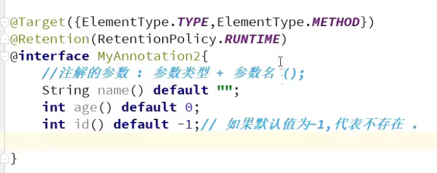
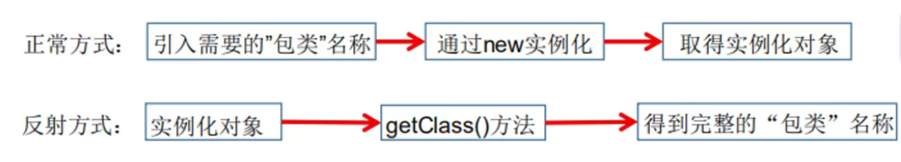
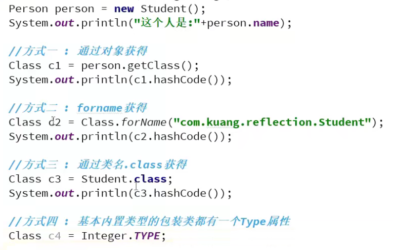
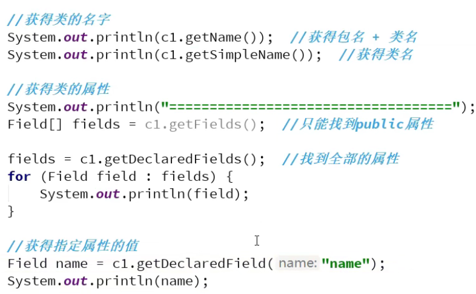
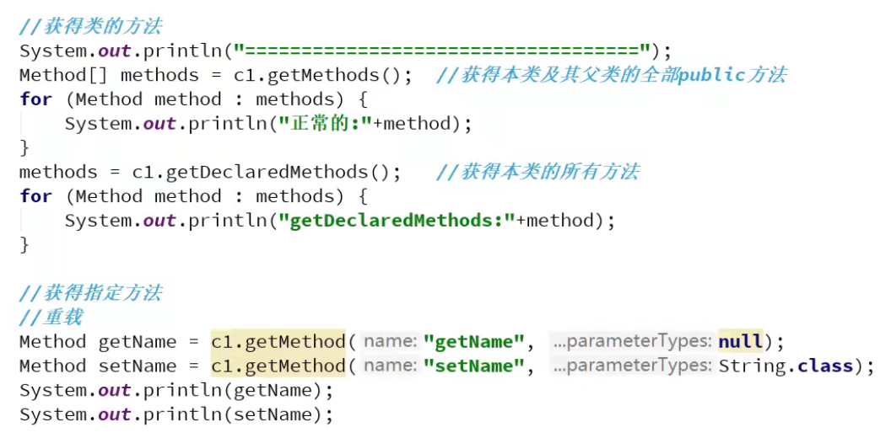
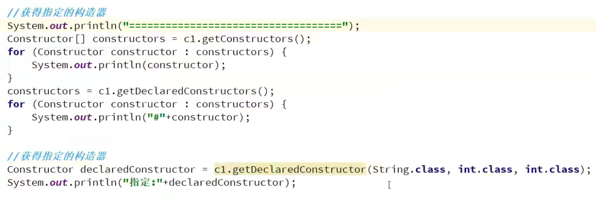
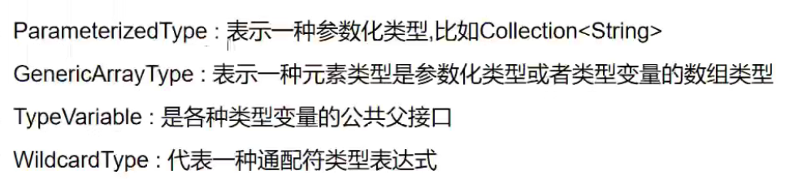

#  注解与反射

## 注解

### 元注解

#### @Retention

Retention 的英文意为保留期的意思。当 @Retention 应用到一个注解上的时候，它解释说明了这个注解的的存活时间。

- RetentionPolicy.SOURCE 注解只在源码阶段保留，在编译器进行编译时它将被丢弃忽视。
- RetentionPolicy.CLASS 注解只被保留到编译进行的时候，它并不会被加载到 JVM 中。
- RetentionPolicy.RUNTIME 注解可以保留到程序运行的时候，它会被加载进入到 JVM 中，所以在程序运行时可以获取到它们。

#### @Documented

顾名思义，这个元注解肯定是和文档有关。它的作用是能够将注解中的元素包含到 Javadoc 中去。

#### @Target

Target 是目标的意思，@Target 指定了注解运用的地方。

你可以这样理解，当一个注解被 @Target 注解时，这个注解就被限定了运用的场景。

类比到标签，原本标签是你想张贴到哪个地方就到哪个地方，但是因为 @Target 的存在，它张贴的地方就非常具体了，比如只能张贴到方法上、类上、方法参数上等等。@Target 有下面的取值

- ElementType.ANNOTATION_TYPE 可以给一个注解进行注解
- ElementType.CONSTRUCTOR 可以给构造方法进行注解
- ElementType.FIELD 可以给属性进行注解
- ElementType.LOCAL_VARIABLE 可以给局部变量进行注解
- ElementType.METHOD 可以给方法进行注解
- ElementType.PACKAGE 可以给一个包进行注解
- ElementType.PARAMETER 可以给一个方法内的参数进行注解
- ElementType.TYPE 可以给一个类型进行注解，比如类、接口、枚举

#### @Inherited

Inherited 是继承的意思，但是它并不是说注解本身可以继承，而是说如果一个超类被 @Inherited 注解过的注解进行注解的话，那么如果它的子类没有被任何注解应用的话，那么这个子类就继承了超类的注解。

### 自定义注解

#### @interface

## 反射

### 反射的功能

在运行时判定任意一个对象所属的类；
在运行时构造任意一个类的对象；
在运行时判定任意一个类所具有的成员变量和方法；
在运行时调用任意一个对象的方法；
生成动态代理。

### 类加载机制

#### 1. 加载

​		加载是类加载的一个阶段，注意不要混淆。

加载过程完成以下三件事：

- 通过类的完全限定名称获取定义该类的二进制字节流。
- 将该字节流表示的静态存储结构转换为方法区的运行时存储结构。
- 在内存中生成一个代表该类的 Class 对象，作为方法区中该类各种数据的访问入口

#### 2. 验证

​		确保 Class 文件的字节流中包含的信息符合当前虚拟机的要求，并且不会危害虚拟机自身的安全。

#### 3. 准备

​		类变量是被 static 修饰的变量，准备阶段为类变量分配内存并设置初始值，使用的是方法区的内存。

​		实例变量不会在这阶段分配内存，它会在对象实例化时随着对象一起被分配在堆中。应该注意到，实例化不是类加载的一个过程，**类加载发生在所有实例化操作之前，并且类加载只进行一次，实例化可以进行多次。**

https://github.com/CyC2018/CS-Notes/blob/master/notes/Java%20%E8%99%9A%E6%8B%9F%E6%9C%BA.md

​		类变量是被 static 修饰的变量，准备阶段为类变量分配内存并设置初始值，使用的是方法区的内存。

​		**这也是为什么**对于一个final变量，如果是基本数据类型的变量，则其数值一旦在初始化之后便不能更改；如果是引用类型的变量，则在对其初始化之后便不能再让其指向另一个对象。

#### 4. 解析

将常量池的符号引用替换为直接引用的过程。

其中解析过程在某些情况下可以在初始化阶段之后再开始，这是为了支持 Java 的动态绑定。

#### 5. 初始化

初始化阶段才真正开始执行类中定义的 Java 程序代码。初始化阶段是虚拟机执行类构造器 <clinit\>() 方法的过程。在准备阶段，**类变量已经赋过一次系统要求的初始值，而在初始化阶段，根据程序员通过程序制定的主观计划去初始化类变量和其它资源。**

<clinit>() 是由编译器自动收集类中所有类变量的赋值动作和静态语句块中的语句合并产生的，编译器收集的顺序由语句在源文件中出现的顺序决定。特别注意的是，静态语句块只能访问到定义在它之前的类变量，定义在它之后的类变量只能赋值，不能访问。

### 类实例的创建方式

#### 获取类的信息

##### 获取类的名字属性以及值

##### 获取类的方法

##### 获取类的构造器

##### 获取泛型

##### 反射读取注解

https://www.bilibili.com/video/BV1p4411P7V3?p=16

#### 双亲委派机制

当相同类名，有父类加载器可以加载的时，优先使用父类可调用的类包

