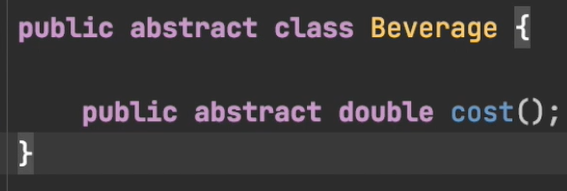
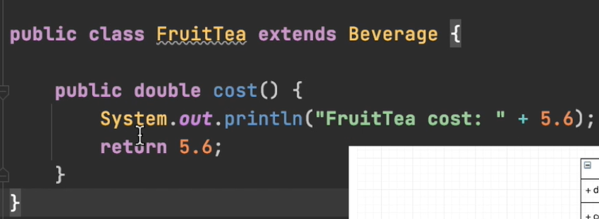
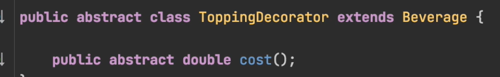
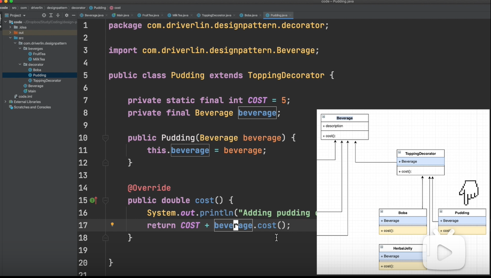
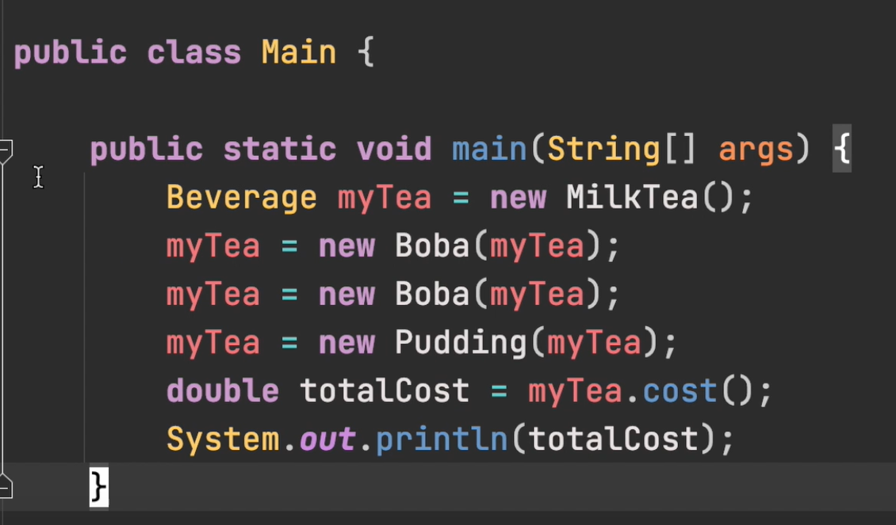
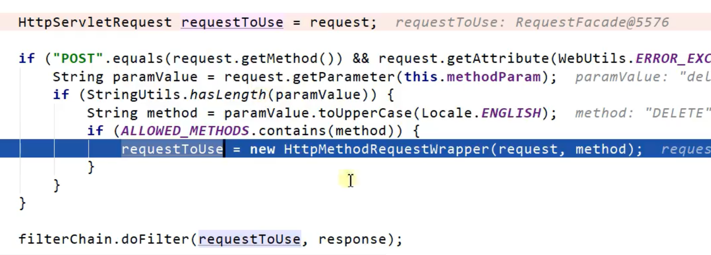
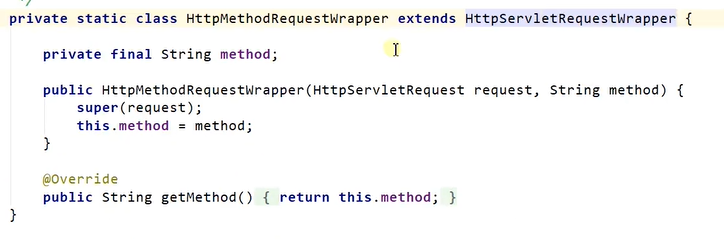
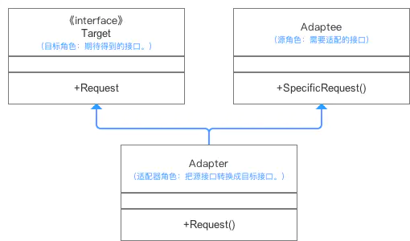
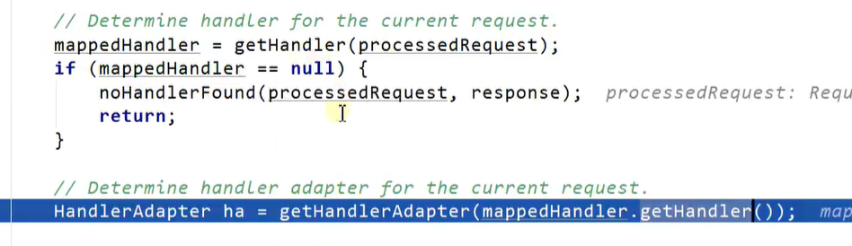
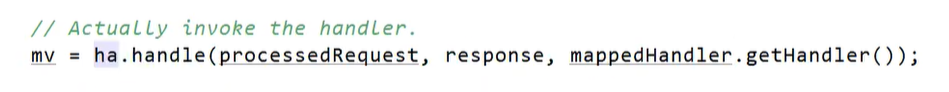

# 设计模式

## 装饰者模式











https://www.bilibili.com/video/BV1Vp4y187dK?from=search&seid=9216454965535468213&spm_id_from=333.337.0.0



下面这个就是装饰器




## 模板方法模式

## 适配器模式

### 主要作用

把一个类的接口变换成客户端所期待的另一种接口，从而使原本接口不匹配而无法一起工作的两个类能够在一起工作。



冲突：Target期待调用Request方法，而Adaptee并没有（这就是所谓的不兼容了）。

解决方案：为使Target能够使用Adaptee类里的SpecificRequest方法，故提供一个中间环节Adapter类**（继承Adaptee & 实现Target接口）**，把Adaptee的API与Target的API衔接起来（适配）。

#### 类的适配器模式

创建**适配器类（Adapter）**

```java
//适配器Adapter继承自Adaptee，同时又实现了目标(Target)接口。
public class Adapter extends Adaptee implements Target {

    //目标接口要求调用Request()这个方法名，但源类Adaptee没有方法Request()
    //因此适配器补充上这个方法名
    //但实际上Request()只是调用源类Adaptee的SpecificRequest()方法的内容
    //所以适配器只是将SpecificRequest()方法作了一层封装，封装成Target可以调用的Request()而已
    @Override
    public void Request() {
        this.SpecificRequest();
    }

}
```

```cpp
public class AdapterPattern {

    public static void main(String[] args){

        Target mAdapter = new Adapter()；
        mAdapter.Request（）;
     
    }
}
```

#### 对象的适配器模式

创建**适配器类（Adapter）**（不适用继承而是委派）


```java
class Adapter implements Target{  
    // 直接关联被适配类  
    private Adaptee adaptee;  
    
    // 可以通过构造函数传入具体需要适配的被适配类对象  
    public Adapter (Adaptee adaptee) {  
        this.adaptee = adaptee;  
    }  
    
    @Override
    public void Request() {  
        // 这里是使用委托的方式完成特殊功能  
        this.adaptee.SpecificRequest();  
    }  
}  
```

定义具体使用目标类，并通过Adapter类调用所需要的方法从而实现目标。

```cpp
public class AdapterPattern {
    public static void main(String[] args){
        //需要先创建一个被适配类的对象作为参数  
        Target mAdapter = new Adapter(new Adaptee())；
        mAdapter.Request();
     
    }
}
```

#### 区别

对于类适配器，由于适配器直接继承了Adaptee，使得适配器不能和Adaptee的子类一起工作，因为继承是静态的关系，当适配器继承了Adaptee后，就不可能再去处理  Adaptee的子类了；

对于对象适配器，一个适配器可以把多种不同的源适配到同一个目标。换言之，同一个适配器可以把源类和它的子类都适配到目标接口。因为对象适配器采用的是对象组合的关系，只要对象类型正确，是不是子类都无所谓。

需要重新定义Adaptee的部分行为：选择类适配器

- 对于类适配器，适配器可以重定义Adaptee的部分行为，相当于子类覆盖父类的部分实现方法。
- 对于对象适配器，要重定义Adaptee的行为比较困难，这种情况下，需要定义Adaptee的子类来实现重定义，然后让适配器组合子类。虽然重定义Adaptee的行为比较困难，但是想要增加一些新的行为则方便的很，而且新增加的行为可同时适用于所有的源。

仅仅希望使用方便时：选择类适配器

- 对于类适配器，仅仅引入了一个对象，并不需要额外的引用来间接得到Adaptee。
- 对于对象适配器，需要额外的引用来间接得到Adaptee。

https://www.jianshu.com/p/9d0575311214





同时适配后使用ha.handle运行各种方法
