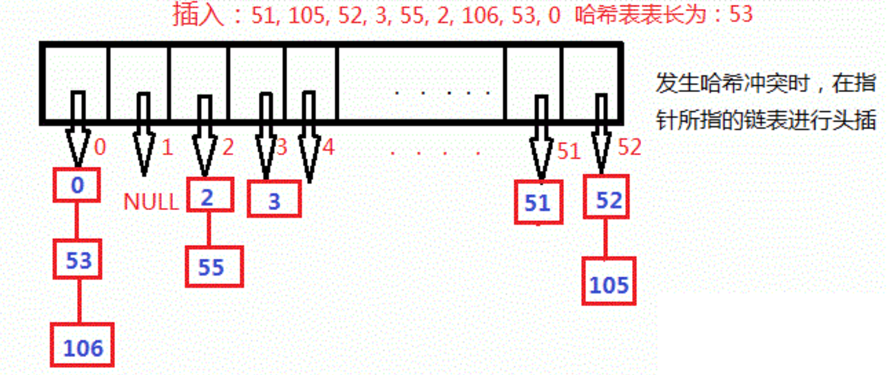
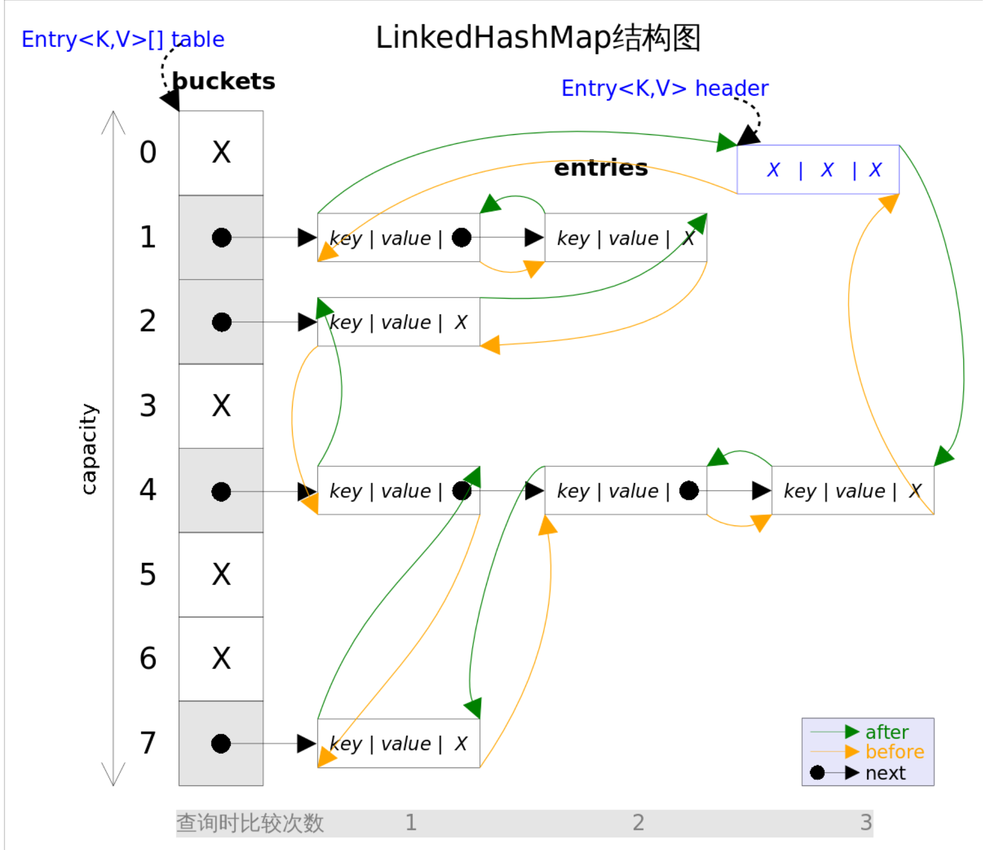

# java基础

## 零零散散的

- 取模运算，结果的符号和被除数符号一致

### 类

#### 初始化


#### 实例化

使用new关键字

Class对象的newInstance()方法

构造函数对象的newInstance()方法

对象反序列化

Object对象的clone()方法

使用Unsafe类创建对象

### 实例变量和类变量

类变量需用static修饰，否则则为实例变量。类变量又称为static变量或者静态变量。

## 泛型

泛型的本质是为了参数化类型。

Java 泛型的参数只可以代表类。

泛型只在编译阶段有效。Java 编译器在编译泛型时会自动加入类型转换的编码。

Java编译器是通过先检查代码中泛型的类型，然后在进行类型擦除，再进行编译。

例如：

```java
public static  void main(String[] args) {  

    ArrayList<String> list = new ArrayList<String>();  
    list.add("123");  
    list.add(123);//编译错误  
}
```

https://www.cnblogs.com/wuqinglong/p/9456193.html

```java
ArrayList<String> list1 = new ArrayList(); //第一种 情况 ArrayList list2 = new ArrayList<String>(); //第二种 情况
```

因为类型检查就是编译时完成的，`new ArrayList()`只是在内存中开辟了一个存储空间，可以存储任何类型对象，而真正设计类型检查的是它的**引用**，因为我们是使用它引用`list1`来调用它的方法，比如说调用`add`方法，所以`list1`引用能完成泛型类型的检查。而引用`list2`没有使用泛型，所以不行。

##### 为什么要进行类型擦除

为了向下兼容

https://www.cnblogs.com/frankcui/p/14373910.html

#### **桥方法**

解决了类型擦除和多态的冲突

详见https://www.cnblogs.com/wuqinglong/p/9456193.html

#### 泛型类型变量不能是基本数据类型

不能用类型参数替换基本类型。就比如，没有`ArrayList<double>`，只有`ArrayList<Double>`。因为当类型擦除后，`ArrayList`的原始类型变为`Object`，但是`Object`类型不能存储`double`值，只能引用`Double`的值。

#### 泛型带来的问题

​		通过反射的方式去进行插入的时候，我们的数据就会发生错误。

​		我们可以在一个`List<Integer>`中在不知情的情况下插入了一个`String`类型的数值

##### 解决

```java
public class Part<T extends Parent> {

    private T val;
     
    public T getVal() {
        return val;
    }
     
    public void setVal(T val) {
        this.val = val;
    }

}
```

将基类重新规划的操作，就算被编译，虚拟机也会知道将数据转化为`Parent`而不是直接用`Object`来直接进行替代。

https://cloud.tencent.com/developer/article/1033693

##### 泛型TEKV区别以及class<T><?>

```java
public class Test {
    public static <T> T createInstance(Class<T> clazz) throws IllegalAccessException, InstantiationException {
        return clazz.newInstance();
    }

    public static void main(String[] args)  throws IllegalAccessException, InstantiationException  {
            Fruit fruit= createInstance(Fruit .class);
            People people= createInstance(People.class);
    }

}
```

https://blog.csdn.net/a519781181/article/details/79424014

### final关键字

https://www.cnblogs.com/dolphin0520/p/3736238.html

##### 其中final方法不能被重写。

将方法定义为final类型可以防止任何子类修改该类的定义与实现方式，同时定义为final的方法执行效率要高于非final方法。在修饰权限中曾经提到过private修饰符，如果一个父类的某个方法被设置为private修饰符，子类将无法访问该方法，自然无法覆盖该方法，所以一个定义为private的方法隐式被指定为final类型，这样无须将一个定义为private的方法再定义为final类型

https://blog.csdn.net/pan_junbiao/article/details/84989697

### String、StringBuffer、StringBuilder

https://stackoverflow.com/questions/2971315/string-stringbuffer-and-stringbuilder

这篇讲的！good！https://blog.csdn.net/itchuxuezhe_yang/article/details/89966303

### StringPool

https://blog.csdn.net/goodstuddayupyyeah/article/details/60882958

### 初始化顺序

存在继承的情况下，初始化顺序为：

- 父类（静态变量、静态语句块）
- 子类（静态变量、静态语句块）
- 父类（实例变量、普通语句块）
- 父类（构造函数）
- 子类（实例变量、普通语句块）
- 子类（构造函数）

### Java中Cloneable的使用

https://www.jianshu.com/p/ea8f7b1fbbb1

https://blog.csdn.net/riemann_/article/details/87217229

浅克隆（shallow clone），浅克隆是指拷贝对象时仅仅copy**对象本身**和**对象中的基本变量**，而不拷贝对象包含的引用指向的对象。

深克隆（deep clone），不仅copy对象本身，而且copy对象包含的引用指向的所有对象。

举例：对象X中包含对Y的引用，Y中包含对Z的引用。浅拷贝X得到X1，X1中依然包含对Y的引用，Y中依然包含对Z的引用。深拷贝则是对浅拷贝的递归，深拷贝X得到X1，X1中包含对Y1（Y的copy）的引用，Y1中包含对Z1（Z的copy）的引用。

### 访问级别不允许低于父类的访问级别

https://blog.csdn.net/xiexingshishu/article/details/53690033?utm_medium=distribute.pc_relevant.none-task-blog-2~default~baidujs_title~default-0.no_search_link&spm=1001.2101.3001.4242.1

## 类

### 抽象类与接口

抽象类和接口是配合而非替代关系，它们经常一起使用，接口声明能力，抽象类提供默认实现，实现全部或部分方法，一个接口经常有一个对应的抽象类。

https://www.cnblogs.com/swiftma/p/5594961.html

#### 接口继承接口

Java中的接口是支持多继承的。

##### 为什么接口可以多继承，而类不可以

归根结底还是对接口的理解问题

接口只关注与功能而不管如何去实现

如果有两个父类，两个父类里有一个相同的方法但是不同的实现，那么作为子类不知道应该继承父类1的还是父类2的方法。

但接口就没有这个问题，不管哪个接口，调用的都是同一个实现，因为只有方法名。


### 内部类

#### 静态内部类

外部类套入静态内部类实际上会生成两个类，一个是Outer，另一个是Outer$StaticInner

```java
public class Outer {
    private static int shared = 100;
    
    public static class StaticInner {
        public void innerMethod(){
            System.out.println("inner " + shared);
        }
    }
    
    public void test(){
        StaticInner si = new StaticInner();
        si.innerMethod();
    }
}
```

内部类访问了外部类的一个私有静态变量shared，而我们知道私有变量是不能被类外部访问的，Java的解决方法是，自动为Outer生成了一个非私有访问方法access$0，它返回这个私有静态变量shared。

#### **方法内部类**

```
public class Outer {
    private int a = 100;
    
    public void test(final int param){
        final String str = "hello";
        class Inner {
            public void innerMethod(){
                System.out.println("outer a " +a);
                System.out.println("param " +param);
                System.out.println("local var " +str);
            }
        }
        Inner inner = new Inner();
        inner.innerMethod();
    }
}
```

方法内部类还可以直接访问方法的参数和方法中的局部变量，不过，这些变量必须被声明为final，如innerMethod直接访问了方法参数param和局部变量str。

https://www.cnblogs.com/swiftma/p/5619071.html

##### Java匿名内部类中使用外部类方法的形参或局部变量必须声明为final

https://blog.csdn.net/tianjindong0804/article/details/81710268?utm_medium=distribute.pc_relevant.none-task-blog-2~default~baidujs_title~default-0.no_search_link&spm=1001.2101.3001.4242.1、

### 回调

就是在参数内写入方法，该方法会在类内部再适当的时候自动调用。

## 异常

### throw和throws的区别

https://blog.csdn.net/interesting_code/article/details/103306389


## java容器

容器主要包括 Collection 和 Map 两种，Collection 存储着对象的集合，而 Map 存储着键值对（两个对象）的映射表。

### collection

#### 扩容

1. 获取原始序列长度
2. 在此基础上扩容1.5或者2倍
3. 与最小需扩容量进行比较，若小于最小需扩容量，则替换成最小需扩容量
4. 若此时需扩容量大于容器最大长度限制，则调用hugeCapacity比较minCapacity和 MAX_ARRAY_SIZE

#### ArrayList

数组的默认大小为 10。

支持快速随机访问。

添加元素时使用 ensureCapacityInternal() 方法来保证容量足够，如果不够时，需要使用 grow() 方法进行扩容，新容量的大小为 `oldCapacity + (oldCapacity >> 1)`，即 oldCapacity+oldCapacity/2。其中 oldCapacity >> 1 需要取整，所以新容量大约是旧容量的 1.5 倍左右。（oldCapacity 为偶数就是 1.5 倍，为奇数就是 1.5 倍-0.5）

扩容操作需要调用 `Arrays.copyOf()` 把原数组整个复制到新数组中，这个操作代价很高，因此最好在创建 ArrayList 对象时就指定大概的容量大小，减少扩容操作的次数。

https://github.com/CyC2018/CS-Notes/blob/master/notes/Java%20%E5%AE%B9%E5%99%A8.md

###### fail-fast机制

当多个线程对同一个集合的内容进行操作时，就可能会产生fail-fast事件。

modCount 用来记录 ArrayList 结构发生变化的次数。结构发生变化是指添加或者删除至少一个元素的所有操作，或者是调整内部数组的大小，仅仅只是设置元素的值不算结构发生变化。

###### fail-safe机制

当集合的结构被改变的时候，fail-safe机制会在复制原集合的一份数据出来，然后在复制的那份数据遍历。	

#### Vector

实现与 ArrayList 类似，但是Vector使用同步方法进行同步。

扩容时每次都令 capacity 为原来的两倍


#### synchronizedList

synchronizedList使用同步代码块实现。 2.两者的扩充数组容量方式不一样

但是， SynchronizedList中实现的类并没有都使用synchronized同步代码块。其中有listIterator和listIterator(int index)并没有做同步处理。但是Vector却对该方法加了方法锁。 所以说，在使用SynchronizedList进行遍历的时候要手动加锁。

之前的比较都是基于我们将ArrayList转成SynchronizedList。那么如果我们想把LinkedList变成线程安全的，或者说我想要方便在中间插入和删除的同步的链表，那么我可以将已有的LinkedList直接转成 SynchronizedList，而不用改变他的底层数据结构。而这一点是Vector无法做到的，因为他的底层结构就是使用数组实现的，这个是无法更改的。

http://www.hollischuang.com/archives/498

#### CopyOnWriteArrayList

CopyOnWrite容器即写时复制的容器。通俗的理解是当我们往一个容器添加元素的时候，不直接往当前容器添加，而是先将当前容器进行Copy，复制出一个新的容器，然后新的容器里添加元素，添加完元素之后，再将原容器的引用指向新的容器。CopyOnWriteArrayList中add/remove等写方法是需要加锁的，目的是为了避免Copy出N个副本出来，导致并发写。但是。CopyOnWriteArrayList中的读方法是没有加锁的。

我们只需要记住一句话，那就是CopyOnWriteArrayList是线程安全的，所以我们在多线程的环境下面需要去使用这个就可以了。

CopyOnWriteArrayList 在写操作的同时允许读操作，大大提高了读操作的性能，因此很适合读多写少的应用场景。

但是 CopyOnWriteArrayList 有其缺陷：

- 内存占用：在写操作时需要复制一个新的数组，使得内存占用为原来的两倍左右；
- 数据不一致：读操作不能读取实时性的数据，因为部分写操作的数据还未同步到读数组中。

所以 CopyOnWriteArrayList 不适合内存敏感以及对实时性要求很高的场景。

https://baijiahao.baidu.com/s?id=1638201147057831295&wfr=spider&for=pc

### Hash

 hash函数是一个native方法, 这个定义在Object类中, 所以所有的对象都会继承.

应用https://zhuanlan.zhihu.com/p/178555720HashMap

算法https://segmentfault.com/a/1190000015798586

扰动https://www.zhihu.com/question/20733617/answer/111577937

##### HashMap

拉链法解决哈希冲突



https://blog.csdn.net/weixin_43083491/article/details/107737045

HashMap 允许插入键为 null 的键值对。但是因为无法调用 null 的 hashCode() 方法，也就无法确定该键值对的桶下标，只能通过强制指定一个桶下标来存放。HashMap 使用第 0 个桶存放键为 null 的键值对。

###### 扰动

jdk1.7

```
h ^= (h >>> 20) ^ (h >>> 12);
return h ^ (h >>> 7) ^ (h >>> 4);
```

jdk1.8

```
    int h;
    return (key == null) ? 0 : (h = key.hashCode()) ^ (h >>> 16);
```

转换成数组下标取模

令一个数 y 与 x-1 做与运算，可以去除 y 位级表示的第 4 位以上数：

```
y       : 10110010
x-1     : 00001111
y&(x-1) : 00000010
```

这个性质和 y 对 x 取模效果是一样的：

```
y   : 10110010
x   : 00010000
y%x : 00000010
```

###### 插入

如果定位到的数组位置没有元素 就直接插入。

如果定位到的数组位置有元素，遍历以这个元素为头结点的链表，依次和插入的key比较，如果key相同就直接覆盖，不同就采用头插法插入元素

###### 扩容		

扩容使用 resize() 实现，需要注意的是，扩容操作同样需要把 oldTable 的所有键值对重新插入 newTable 中

由于HashMap 使用 hash%capacity 来确定桶下标，所以扩容时需要把键值对重新计算桶下标。

当需要扩容时，令 capacity 为原来的两倍

超过最大值就不再扩充了，就碰撞去

###### HashMap 不能保证随着时间的推移 Map 中的元素次序是不变的

https://blog.csdn.net/wobuaizhi/article/details/84105647

https://blog.csdn.net/qq_36381855/article/details/79792391

###### 为什么覆盖equals时也要覆盖hashCode方法

https://blog.csdn.net/gkmmg/article/details/80296238

#### ConcurrentHashMap

ConcurrentHashMap 采用了分段锁（Segment），每个分段锁维护着几个桶（HashEntry），多个线程可以同时访问不同分段锁上的桶，从而使其并发度更高（并发度就是 Segment 的个数，默认16）

·JDK 1.7 使用分段锁机制来实现并发更新操作，核心类为 Segment，它继承自重入锁 ReentrantLock，并发度与 Segment 数量相等。

JDK 1.8 使用了 CAS 操作来支持更高的并发度，在 CAS 操作失败时使用内置锁 synchronized。

CAS 的指令允许算法执行读-修改-写操作，而无需害怕其他线程同时 修改变量，因为如果其他线程修改变量，那么 CAS 会检测它（并失败），算法 可以对该操作重新计算。

对于资源竞争较少的情况：性能cas>synchronized，使用synchronized同步锁进行线程阻塞和唤醒切换以及用户态内核态间的切换操作额外浪费消耗cpu资源；而CAS基于硬件实现，不需要进入内核，不需要切换线程，操作自旋几率较少，因此可以获得更高的性能。

于资源竞争严重的情况：性能cas<synchronized，CAS自旋的概率会比较大，从而浪费更多的CPU资源，效率低于synchronized。

#### LinkedHashMap

内部维护了一个双向链表，用来维护插入顺序或者 LRU 顺序。

​		列一下Entry里面有的一些属性吧：

1、K key

2、V value

3、Entry<K, V> next

4、int hash

**5、Entry<K, V> before**

**6、Entry<K, V> after**

其中前面四个，也就是细体部分是从HashMap.Entry中继承过来的；后面两个，也就是粗体部分是LinkedHashMap独有的。不要搞错了next和before、After，**next是用于维护HashMap指定table位置上连接的Entry的顺序的，before、After是用于维护Entry插入的先后顺序的**。



这篇讲的贼棒https://www.cnblogs.com/xiaoxi/p/6170590.html

###### 插入 

```java
void createEntry(int hash, K key, V value, int bucketIndex) {
    HashMap.Entry<K,V> old = table[bucketIndex];
    Entry<K,V> e = new Entry<K,V>(hash, key, value, old);
    table[bucketIndex] = e;
    //将该节点插入到链表尾部
    e.addBefore(header);
    size++;
}
private void addBefore(Entry<K,V> existingEntry) {
    after  = existingEntry;
    before = existingEntry.before;
    before.after = this;
    after.before = this;
}
```

##### **利用LinkedHashMap实现LRU算法缓存**

如果有1 2 3这3个Entry，那么访问了1，就把1移到尾部去，即2 3 1。每次访问都把访问的那个数据移到双向队列的尾部去，那么每次要淘汰数据的时候，双向队列最头的那个数据不就是最不常访问的那个数据了吗？换句话说，双向链表最头的那个数据就是要淘汰的数据。

"访问"，这个词有两层意思：

1、根据Key拿到Value，也就是get方法

2、修改Key对应的Value，也就是put方法

#### WeakHashMap

##### 引用类型

在JAVA中提供了四种引用类型：强引用、软引用、软引用和虚引用。在四种引用类型中，只有强引用FinalReference类型变量是包内可见的，其他三种引用类型均为public，可以在程序中直接使用。


Java将引用分为四类（从JDK1.2开始），强度依次逐渐减弱：

- 强引用： 就是平常使用的普通引用对象，例如`Object obj = new Object()`，这就是一个强引用，强引用只要还存在，就不会被垃圾收集器回收。
- 软引用： 软引用表示一个还有用但并非必需的对象，不像强引用，它还需要通过SoftReference类来间接引用目标对象（除了强引用都是如此）。被软引用关联的对象，在将要发生内存溢出异常之前，会被放入回收范围之中以进行第二次回收（如果第二次回收之后依旧没有足够的内存，那么就会抛出OOM异常）。
- 弱引用： 同样是表示一个非必需的对象，但要比软引用的强度还要弱，需要通过WeakReference类来间接引用目标对象。被弱引用关联的对象只能存活到下一次垃圾回收发生之前，当触发垃圾回收时，无论当前内存是否足够，都会回收掉只被弱引用关联的对象（如果这个对象还被强引用所引用，那么就不会被回收）。
- 虚引用： 这是一种最弱的引用关系，需要通过PhantomReference类来间接引用目标对象。一个对象是否有虚引用的存在，完全不会对其生存时间构成影响，也无法通过虚引用来获得对象实例。虚引用的唯一作用就是能在这个对象被回收时收到一个系统通知（结合ReferenceQueue使用）。基于这点可以通过虚引用来实现对象的析构函数，这比使用`finalize()`函数是要靠谱多了。
- https://blog.csdn.net/u014086926/article/details/52106589

#### ReferenceQueue

https://www.iflym.com/index.php/java-programe/201407140001.html

#### unmodifiableMap

unmodifiableMap方法的作用就是将一个Map 进行包装，返回一个不可修改的Map。如果调用修改方法就会抛出java.lang.UnsupportedOperationException异常。

https://www.cnblogs.com/zhangchengzi/p/9685918.html
