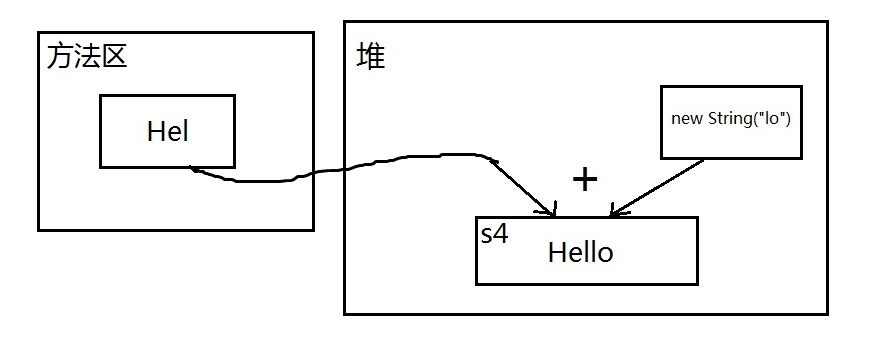
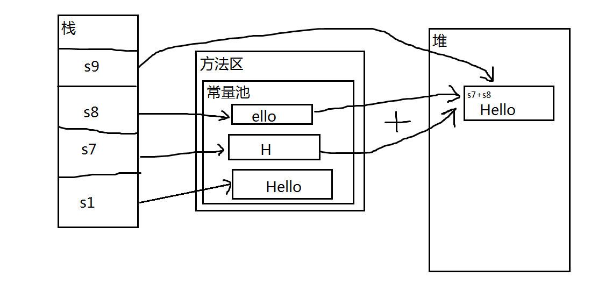

# java基础

## 零零散散的

- 取模运算，结果的符号和被除数符号一致

## 面对对象

### 封装

封装就是模块化

比如一个相似的功能，你把他写在统一个方法里，不进行封装，那么，你每次进行修改了这个方法后，你都要提心吊胆，是否会影响其他的功能，测试人员，还要根据你的感觉，去测试其他的功能，无形中给自己和别人都添加了麻烦。


#### default和protected区别

包结构：

注释的代码代表不能编译，先写一个QWE类用于被继承，里面一个protected修饰的方法一个default修饰的方法

```java
package qwe;

public class FU {
    protected void fuSay(){
        System.out.println("haha");
    }
    void hehe(){
        System.out.println("hehe");
    }
}


package qwe;

public class ZI extends FU{
    public static void main(String[] args) {
        ZI zi=new ZI();
        zi.fuSay();
        zi.hehe();
        FU fu=new FU();
        fu.fuSay();
        fu.hehe();
    }

    public void aa(){
        fuSay();
        hehe();
    }

}
```

 从上面代码可以看到，同包下继承，两者都可以通过子类对象和父类对象调用，子类内也可调用

```java
package asd;

import qwe.FU;

public class ZI extends FU {
    public static void main(String[] args) {
        asd.ZI asd=new asd.ZI();
        asd.fuSay();
//        asd.hehe();
        QWE qwe=new QWE();
//        qwe.fuSay();
//        qwe.hehe();
    }
    public void ss(){
        fuSay();
    }
}
```

 不同包下继承，因为父类方法不是public所以都不能调用，子类对象可以调用protected修饰的方法

但是：

```java
import asd.ASD;

public class Main {

    public static void main(String[] args) {
        ASD asd=new ASD();

//        asd.haha();
    }
}
```

子类对象可以在子类内调用继承来的protected方法，但是不能在其它类内调用该方法

也就是说protected修饰的方法可以在子类内部调用却不能在子类外部调用


注意：Java的访问控制是停留在编译层的，也就是它不会在.class文件中留下任何的痕迹，只在编译的时候进行访问控制的检查。其实，通过反射的手段，是可以访问任何包下任何类中的成员，例如，访问类的私有成员也是可能的。

#### Final 和 static

##### Static

如果想要一个类的所有实例共享数据，就要使用静态变量。也叫类变量
所以static关键字的作用就是用来共享数据的。

所以方法里面的变量不能用static修饰（局部变量）
static修饰的变量如果修改，所有用的对象实例的值都修改了
static 修饰的变量，在类的初始化加载阶段 链接中的准备 阶段为类变量分配内存并且设置该类变量的默认初始值，即零值。然后初始化阶段如果显式赋值就会赋值。
初始化阶段就是执行类构造器法()，此方法不需定义，是javac编译器自动收集类中的所有类变量的赋值动作和静态代码块中的语句合并而来。

static 变量存在常量池中，运行时保存在 方法区中jdk6，jdk7之后保存在堆中 和 StringTable一起。

##### Final

常量，就是把final和static的特点结合到一起

在编译的时候就被分配了

内存中 存储在哪里？ **常量池** 也就是 方法区中

https://blog.csdn.net/qq_33823794/article/details/112689467

#### 

### 继承

#### 关于构造方法中super()

##### 第一种情况：编译不通过

 


分析：

如果一个类中没有写任何的构造方法，JVM会生成一个默认的无参构造方法。在继承关系中，由于在子类的构造方法中，第一条语句默认为调用父类的无参构造方法（即默认为super()，一般这句话省略了）。所以当在父类中定义了有参构造函数，都是没有定义无参构造函数时，IDE会强制要求我们定义一个相同参数类型的构造器。

在本例中`JVM默认给B加了一个无参构造方法，而在这个方法中默认调用了super()，但是父类中并不存在该构造方法`

##### 第二种情况：编译不通过


```
同样编译错误，相同的道理，虽然我们在子类中自己定义了一个构造方法，但是在这个构造方法中还是默认调用了super()，但是父类中并不存在该构造方法
```

##### 第三种情况：成功编译通过

```scala
public class A {
    
	public A(String s) {
        
	}
}

public class B extends A{

	public B(String s) {
		super(s);
	}

}
```

分析：

所以，只要记住，在子类的构造方法中，只要里面没有显示的通过super去调用父类相应的构造方法，默认都是调用super()，即无参构造方法，因此要确保父类有相应的构造方法。

#### 关于方法的super

子类继承父类就是继承的时候，拿到了父类的方法，

如果重写了这个方法，子类就失去了父类方法的实现。

当一个类继承于另一个类，子类中没有父类的方法时。用子类的对象调用方法时，会首先在子类中查找，如果子类中没有改方法，再到父类中查找。

代码如下：


#### 继承的缺点

如果父类中静态的东西很多，那无论什么子类都会加载的很慢很慢

想把子类移植到其他项目很难。

子类依赖于父类的实现细节，如果父类产生了变更，子类的后果将不堪设想。

### 子类“覆盖”父类的成员变量

即使子类声明了与父类完全一样的成员变量，也不会覆盖掉父类的成员变量。而是在子类实例化时，会同时定义两个成员变量，子类也可以同时访问到这两个成员变量(this.i&super.i)，但父类不能访问到子类的成员变量（父类不知道子类的存在）。

### 组合


#### 什么时候该用继承，什么时候该用组合？

　　以下两条原则说明了应该如何选择继承与组合：

- 如果存在一种IS-A的关系（比如Bee“是一个”Insect），并且一个类需要向另一个类暴露所有的方法接口，那么更应该用继承的机制。
- 如果存在一种HAS-A的关系（比如Bee“有一个”attack功能），那么更应该运用组合。

https://www.cnblogs.com/vincent-blog/p/4389871.html

## 基本数据类型

Java 中有 8 种基本数据类型，分别为：

1. 6 种数字类型 ：`byte`、`short`、`int`、`long`、`float`、`double`
2. 1 种字符类型：`char`
3. 1 种布尔型：`boolean`。

这 8 种基本数据类型的默认值以及所占空间的大小如下：

| 基本类型  | 位数 | 字节 | 默认值  |
| --------- | ---- | ---- | ------- |
| `int`     | 32   | 4    | 0       |
| `short`   | 16   | 2    | 0       |
| `long`    | 64   | 8    | 0L      |
| `byte`    | 8    | 1    | 0       |
| `char`    | 16   | 2    | 'u0000' |
| `float`   | 32   | 4    | 0f      |
| `double`  | 64   | 8    | 0d      |
| `boolean` | 1    |      | false   |

另外，对于 `boolean`，官方文档未明确定义，它依赖于 JVM 厂商的具体实现。逻辑上理解是占用 1 位，但是实际中会考虑计算机高效存储因素。

### 常量池技术

Java 基本类型的包装类的大部分都实现了常量池技术。

`Byte`,`Short`,`Integer`,`Long` 这 4 种包装类默认创建了数值 **[-128，127]** 的相应类型的缓存数据，

`Character` 创建了数值在 **[0,127]** 范围的缓存数据，

`Boolean` 直接返回 `True` Or `False`。

两种浮点数类型的包装类 `Float`,`Double` 并没有实现常量池技术。

## 值

### 值传递

Java 程序设计语言对对象采用的不是引用调用，实际上，对象引用是按 值传递的。

下面再总结一下 Java 中方法参数的使用情况：

- 一个方法不能修改一个基本数据类型的参数（即数值型或布尔型）。
- 一个方法可以改变一个对象参数的状态。
- 一个方法不能让对象参数引用一个新的对象。

## 构造函数

那如果不在构造方法里边给变量赋值咋办？比如这样：

publicclassTestClass{public String name = "TestClass";publicTestClass(){}}

**MDove**：你口中所谓的不在构造方法里边赋值，只是java层面的而已。我们看一看字节码就清楚了：


**MDove**：看到了吧？我们的java文件在被编译成class文件时。我们的编译器会把对应成员变量初始化操作的字节码写到构造方法里边

## 类

#### 初始化


#### 实例化

使用new关键字

Class对象的newInstance()方法

构造函数对象的newInstance()方法

对象反序列化

Object对象的clone()方法

使用Unsafe类创建对象

### 抽象类与接口

设计层面不同，抽象类作为很多子类的父类，它是一种模板式设计。而接口是一种行为规范，它是一种辐射式设计。什么是模板式设计？最简单例子，大家都用过ppt里面的模板，如果用模板A设计了ppt B和ppt C，ppt B和ppt C公共的部分就是模板A了，如果它们的公共部分需要改动，则只需要改动模板A就可以了，不需要重新对ppt B和ppt C进行改动。而辐射式设计，比如某个电梯都装了某种报警器，一旦要更新报警器，就必须全部更新。也就是说对于抽象类，如果需要添加新的方法，可以直接在抽象类中添加具体的实现，子类可以不进行变更；而对于接口则不行，如果接口进行了变更，则所有实现这个接口的类都必须进行相应的改动。

https://www.cnblogs.com/dolphin0520/p/3811437.html

抽象类和接口是配合而非替代关系，它们经常一起使用，接口声明能力，抽象类提供默认实现，实现全部或部分方法，一个接口经常有一个对应的抽象类。

1.首先是设计接口IService，定义行为service();

 2.然后是接口实现，你会发现多个实现类中干了一些重复的事情，这时我们再设计一个抽象类AbstractService

 3.AbstractService中定义同样的service()方法，将上一步发现的重复内容提取到该方法中

 4.对于第2步的多个实现类来说，现在重复的部分已经被提取了，剩下的就只有各自特殊的部分了，我们再在抽象类中为特殊的部分定义一个抽象的方法doService()

 5.将第2步的多个实现类去掉implements接口，改为继承抽象类，实现doService()方法，去掉重复部分的内容，只留下各自特殊的部分

 6.接下来，我们要考虑接口还有没有存在的必要了，如果你觉得现在或未来可能有另一种实现类，它并没有和其他实现类重复的部分，那就留下来，让抽象类实现这个接口，那继承体系就是这样：


如果，你觉得不会存在这种情况，那就去掉这个接口，继承体系就是这样：


当然了，是否去掉接口是见仁见智的事情，仅仅根据我上面说的标准来决定可能会有点武断。还用上面两类继承体系举例，下面的继承体系下，如果顶层的AbstractService中方法比较多，充斥着实现细节，看起来可能会比较费劲。相对来说，上面的继承体系下，顶层的IService只有简单的方法声明，可以很明确的表明其设计意图，get到这个意图后，再去看细节部分，就更明了

https://blog.csdn.net/wb_snail/article/details/78862533

https://www.cnblogs.com/swiftma/p/5594961.html

#### 接口继承接口

Java中的接口是支持多继承的。

##### 为什么接口可以多继承，而类不可以

归根结底还是对接口的理解问题

接口只关注与功能而不管如何去实现

如果有两个父类，两个父类里有一个相同的方法但是不同的实现，那么作为子类不知道应该继承父类1的还是父类2的方法。

但接口就没有这个问题，不管哪个接口，调用的都是同一个实现，因为只有方法名。


### 内部类

#### 静态内部类

外部类套入静态内部类实际上会生成两个类，一个是Outer，另一个是Outer$StaticInner

```java
public class Outer {
    private static int shared = 100;
    
    public static class StaticInner {
        public void innerMethod(){
            System.out.println("inner " + shared);
        }
    }
    
    public void test(){
        StaticInner si = new StaticInner();
        si.innerMethod();
    }
}
```

内部类访问了外部类的一个私有静态变量shared，而我们知道私有变量是不能被类外部访问的，Java的解决方法是，自动为Outer生成了一个非私有访问方法access$0，它返回这个私有静态变量shared。

#### **方法内部类**

```
public class Outer {
    private int a = 100;
    
    public void test(final int param){
        final String str = "hello";
        class Inner {
            public void innerMethod(){
                System.out.println("outer a " +a);
                System.out.println("param " +param);
                System.out.println("local var " +str);
            }
        }
        Inner inner = new Inner();
        inner.innerMethod();
    }
}
```

方法内部类还可以直接访问方法的参数和方法中的局部变量，不过，这些变量必须被声明为final，如innerMethod直接访问了方法参数param和局部变量str。

https://www.cnblogs.com/swiftma/p/5619071.html

##### Java匿名内部类中使用外部类方法的形参或局部变量必须声明为final

https://blog.csdn.net/tianjindong0804/article/details/81710268?utm_medium=distribute.pc_relevant.none-task-blog-2~default~baidujs_title~default-0.no_search_link&spm=1001.2101.3001.4242.1、

### 回调

就是在参数内写入方法，该方法会在类内部再适当的时候自动调用。

### 实例变量和类变量

类变量需用static修饰，否则则为实例变量。类变量又称为static变量或者静态变量。

## 泛型

泛型的本质是为了参数化类型。

Java 泛型的参数只可以代表类。

泛型只在编译阶段有效。Java 编译器在编译泛型时会自动加入类型转换的编码。

Java编译器是通过先检查代码中泛型的类型，然后在进行类型擦除，再进行编译。

例如：

```java
public static  void main(String[] args) {  

    ArrayList<String> list = new ArrayList<String>();  
    list.add("123");  
    list.add(123);//编译错误  
}
```

https://www.cnblogs.com/wuqinglong/p/9456193.html

```java
ArrayList<String> list1 = new ArrayList(); //第一种 情况 ArrayList list2 = new ArrayList<String>(); //第二种 情况
```

因为类型检查就是编译时完成的，`new ArrayList()`只是在内存中开辟了一个存储空间，可以存储任何类型对象，而真正设计类型检查的是它的**引用**，因为我们是使用它引用`list1`来调用它的方法，比如说调用`add`方法，所以`list1`引用能完成泛型类型的检查。而引用`list2`没有使用泛型，所以不行。

##### 为什么要进行类型擦除

为了向下兼容

###### 1-“真泛型”是怎么操作的？

- 若 Java 语言实现"真泛型"，对泛型类型(泛型类、泛型接口)、泛型方法的名字使用特别的编码，例如将 Factory<T> 类生成为一个名为 “Factory@@T” 的类，这种特别的编码后的名字将被编译器识别，作为判断是否为泛型的依据。
- 如果编译时发现有对 Factory<String> 的使用，则将 “Factory@@T” 的所有逻辑复制一份，新建 “Factory@String@” 类，将原本的占位符 T 替换为 String 。然后在编译 new Factory<String>() 时生成 new Factory@String@() 即可。

###### 2-“真泛型”会导致什么后果？

- 2.1 大规模的代码修改
  - 假设A调用B1 lib，然后B1 lib迁移到了Java 5,并使用了泛型。那么A 也必须升级到Java 5,并修改代码。在 Java 中不支持高版本的 Java 编译生成的 class 文件在低版本的 JRE 上运行，如果尝试这么做，就会得到 UnsupportedClassVersionError 错误。如下图所示：


 

 

 2.2 非泛型类型和泛型不匹配

在 A 项目中，A 项目引用了 B1 lib 中的 ArrayList（用 list 变量记录），那么假设 A 项目升级到 Java 5 后，还是引用的 B1 lib，那么必然会出现如下这种情况：

下述代码中，A 项目将泛化后 ArrayList<T> 的传递给了 B1 lib 中的 ArrayList。

```
ArrayList list = new ArrayList<String>();
```

- 左边：B1 lib 中的老版本 ArrayList
- 右边：A 项目 中的新泛型版本 ArrayList<T>

这种情况的出现，会导致一个问题。就是 b1 项目中的 ArrayList 是不知道 A 项目中的 Arraylist 已经泛型化了的，那么如何保证泛型化后的 ArrayList（也就是ArrayList<T>）与老版本的 ArrayList 等价呢？
如果按照我们之前讲解的 “真泛型” 思路来处理 Java 的泛型， 那么 new ArrayList<String>() 实际会被替换为 new ArrayList@String@()，那么实际运行代码是这样：

```
ArrayList list = new ArrayList@String@()
```

从代码逻辑上来看，根本就跑不通。因为 ArrayList 与 ArrayList@String@ 根本就不是同一类， 那怎么办呢？
最为直接的解决方案就是，不再为参数化类型创造新类了，同时在编译期间将泛型类型中的类型参数全部替换 Object（因为不创建新类了，那么在泛型类中的 T 对应的类型，只能用 Object 替换）。

 

###### 3-为了兼容JDK 5 之前的项目

通过编译器的”魔法“，Java 就解决了处理泛型兼容老版本的问题。

```
//编译器的代码
 Node node = new Node<String>();
 //编译后的代码
 Node node = new Node();
```

https://www.cnblogs.com/frankcui/p/14373910.html

#### **桥方法**

解决了类型擦除和多态的冲突

详见https://www.cnblogs.com/wuqinglong/p/9456193.html

使用Class<T>和Class<?>多发生在反射场景下，先看看如果我们不使用泛型，反射创建一个类是什么样的。

```java
People people = (People) Class.forName("com.lyang.demo.fanxing.People").newInstance();
```

看到了么，需要强转，如果反射的类型不是People类，就会报
**java.lang.ClassCastException**错误。

使用Class<T>泛型后，不用强转了

```java
public class Test {
    public static <T> T createInstance(Class<T> clazz) throws IllegalAccessException, InstantiationException {
        return clazz.newInstance();
    }
    public static void main(String[] args)  throws IllegalAccessException, InstantiationException  {
            Fruit fruit= createInstance(Fruit .class);
            People people= createInstance(People.class);
    }
}
```

#### 泛型类型变量不能是基本数据类型

不能用类型参数替换基本类型。就比如，没有`ArrayList<double>`，只有`ArrayList<Double>`。因为当类型擦除后，`ArrayList`的原始类型变为`Object`，但是`Object`类型不能存储`double`值，只能引用`Double`的值。

#### 泛型带来的问题

​		通过反射的方式去进行插入的时候，我们的数据就会发生错误。

​		我们可以在一个`List<Integer>`中在不知情的情况下插入了一个`String`类型的数值

##### 解决

```java
public class Part<T extends Parent> {

    private T val;
     
    public T getVal() {
        return val;
    }
     
    public void setVal(T val) {
        this.val = val;
    }

}
```

将基类重新规划的操作，就算被编译，虚拟机也会知道将数据转化为`Parent`而不是直接用`Object`来直接进行替代。

https://my.oschina.net/u/4872612/blog/4812319

https://cloud.tencent.com/developer/article/1033693

##### 泛型TEKV区别以及class<T><?>

- **？** 表示不确定的java类型
- **T (type)** 表示具体的一个java类型
- **K V (key value)** 分别代表java键值中的Key Value
- **E (element)** 代表Element

```java
public class Test {
    public static <T> T createInstance(Class<T> clazz) throws IllegalAccessException, InstantiationException {
        return clazz.newInstance();
    }

    public static void main(String[] args)  throws IllegalAccessException, InstantiationException  {
            Fruit fruit= createInstance(Fruit .class);
            People people= createInstance(People.class);
    }

}
```

https://blog.csdn.net/a519781181/article/details/79424014

<? extends T>

不能使用set，因为只规定了上界，

https://blog.csdn.net/jeffleo/article/details/52250948

### final关键字

https://www.cnblogs.com/dolphin0520/p/3736238.html

##### 其中final方法不能被重写。

将方法定义为final类型可以防止任何子类修改该类的定义与实现方式，同时定义为final的方法执行效率要高于非final方法。在修饰权限中曾经提到过private修饰符，如果一个父类的某个方法被设置为private修饰符，子类将无法访问该方法，自然无法覆盖该方法，所以一个定义为private的方法隐式被指定为final类型，这样无须将一个定义为private的方法再定义为final类型

https://blog.csdn.net/pan_junbiao/article/details/84989697

#### 为什么"sdf" != "s"+"df"

反编译后的代码如下：

```java
String s = "abc";
String ss = (new StringBuilder("ok")).append(s).append("xyz").append(5).toString();
System.out.println(ss);
```

使用jad反编译的好处之一就是可以同时生成字节码和源代码。这样可以进行对照研究。从上面的代码很容易看出，虽然在源程序中使用了"+"，但在编译时仍然将"+"转换成StringBuilder。因此，我们可以得出结论，在Java中无论使用何种方式进行字符串连接，实际上都使用的是StringBuilder。

https://blog.csdn.net/chang384915878/article/details/79535708

## String

```java
以  MyTest下面的为列：

 1 String s1 = "Hello";
 2 String s2 = "Hello";
 3 String s3 = "Hel" + "lo";
 4 String s4 = "Hel" + new String("lo");
 5 String s5 = new String("Hello");
 6 String s6 = s5.intern();
 7 String s7 = "H";
 8 String s8 = "ello";
 9 String s9 = s7 + s8;
10           
11 System.out.println(s1 == s2);  // true
12 System.out.println(s1 == s3);  // true
13 System.out.println(s1 == s4);  // false
14 System.out.println(s1 == s9);  // false
15 System.out.println(s4 == s5);  // false
16 System.out.println(s1 == s6);  // true
```

1.String a = "str" ------------         首先虚拟机会从方法区中去寻找是否有，有的话就直接把地址赋值给a ,没有的话，就在方法区中开辟一个内存在存储.(方法区的回收不会那么频繁，只有当内存不够的时候才会销毁不用的常量，非静态的)

2.String b = new String("str)  他是直接在堆内存中，直接开辟一个内存来存储的，把地址给 b

所以  a == b = false

看过上面的现在讲解下

s1 , s2 因为是在加载的时候，内容都一样所以肯定相等

s1 == s3这个地方有个坑，s3虽然是动态拼接出来的字符串，但是所有参与拼接的部分都是已知的字面量，在编译期间，这种拼接会被优化，编译器直接帮你拼好，因此String s3 = "Hel" + "lo";在class文件中被优化成String s3 = "Hello"，所以s1 == s3成立。只有使用引号包含文本的方式创建的String对象之间使用“+”连接产生的新对象才会被加入字符串池中

  s1 == s4当然不相等，s4虽然也是拼接出来的，但new String("lo")这部分不是已知字面量，是一个不可预料的部分，编译器不会优化，必须等到运行时才可以确定结果，结合字符串不变定理，鬼知道s4被分配到哪去了，所以地址肯定不同。对于所有包含new方式新建对象（包括null）的“+”连接表达式，它所产生的新对象都不会被加入字符串池中。

配上一张简图理清思路：

​     

s1 == s9也不相等，道理差不多，虽然s7、s8在赋值的时候使用的字符串字面量，但是拼接成s9的时候，s7、s8作为两个变量，都是不可预料的，编译器毕竟是编译器，不可能当解释器用，不能在编译期被确定，所以不做优化，只能等到运行时，在堆中创建s7、s8拼接成的新字符串，在堆中地址不确定，不可能与方法区常量池中的s1地址相同。



 s4 == s5已经不用解释了，绝对不相等，二者都在堆中，但地址不同。

 s1 == s6这两个相等完全归功于intern方法，s5在堆中，内容为Hello ，intern方法会尝试将Hello字符串添加到常量池中，并返回其在常量池中的地址，因为常量池中已经有了Hello字符串，所以intern方法直接返回地址；而s1在编译期就已经指向常量池了，因此s1和s6指向同一地址，相等。

https://blog.csdn.net/xueyoubangbang/article/details/90039658

### String.equals()

比较 String 字符串的值是否相等，可以使用 `equals()` 方法。 `String` 中的 `equals` 方法是被重写过的。 `Object` 的 `equals` 方法是比较的对象的内存地址，而 `String` 的 `equals` 方法比较的是字符串的值是否相等。 ----- 著作权归Guide哥所有。 链接: https://javaguide.cn/java/jvm/memory-area/#_4-1-%E5%AD%97%E7%AC%A6%E4%B8%B2%E5%B8%B8%E9%87%8F%E6%B1%A0%E5%B8%B8%E8%A7%81%E9%97%AE%E9%A2%98

### String、StringBuffer、StringBuilder

https://stackoverflow.com/questions/2971315/string-stringbuffer-and-stringbuilder

这篇讲的！good！https://blog.csdn.net/itchuxuezhe_yang/article/details/89966303

### StringPool

https://blog.csdn.net/goodstuddayupyyeah/article/details/60882958

## 初始化顺序

存在继承的情况下，初始化顺序为：

- 父类（静态变量、静态语句块）
- 子类（静态变量、静态语句块）
- 父类（实例变量、普通语句块）
- 父类（构造函数）
- 子类（实例变量、普通语句块）
- 子类（构造函数）

## Java中Cloneable的使用

https://www.jianshu.com/p/ea8f7b1fbbb1

https://blog.csdn.net/riemann_/article/details/87217229

浅克隆（shallow clone），浅克隆是指拷贝对象时仅仅copy**对象本身**和**对象中的基本变量**，而不拷贝对象包含的引用指向的对象。

深克隆（deep clone），不仅copy对象本身，而且copy对象包含的引用指向的所有对象。

举例：对象X中包含对Y的引用，Y中包含对Z的引用。浅拷贝X得到X1，X1中依然包含对Y的引用，Y中依然包含对Z的引用。深拷贝则是对浅拷贝的递归，深拷贝X得到X1，X1中包含对Y1（Y的copy）的引用，Y1中包含对Z1（Z的copy）的引用。

### 访问级别不允许低于父类的访问级别

https://blog.csdn.net/xiexingshishu/article/details/53690033?utm_medium=distribute.pc_relevant.none-task-blog-2~default~baidujs_title~default-0.no_search_link&spm=1001.2101.3001.4242.1

## 异常

Exception ：受检查的异常，这种异常是强制我们catch或throw的异常。你遇到这种异常必须进行catch或throw，如果不处理，编译器会报错。比如：IOException。

RuntimeException：运行时异常，这种异常我们不需要处理，完全由虚拟机接管。比如我们常见的NullPointerException，我们在写程序时不会进行catch或throw。

### throw和throws的区别

https://blog.csdn.net/interesting_code/article/details/103306389


## java容器

容器主要包括 Collection 和 Map 两种，Collection 存储着对象的集合，而 Map 存储着键值对（两个对象）的映射表。

### collection

#### 扩容

1. 获取原始序列长度
2. 在此基础上扩容1.5或者2倍
3. 与最小需扩容量进行比较，若小于最小需扩容量，则替换成最小需扩容量
4. 若此时需扩容量大于容器最大长度限制，则调用hugeCapacity比较minCapacity和 MAX_ARRAY_SIZE

#### ArrayList

数组的默认大小为 10。

支持快速随机访问。

添加元素时使用 ensureCapacityInternal() 方法来保证容量足够，如果不够时，需要使用 grow() 方法进行扩容，新容量的大小为 `oldCapacity + (oldCapacity >> 1)`，即 oldCapacity+oldCapacity/2。其中 oldCapacity >> 1 需要取整，所以新容量大约是旧容量的 1.5 倍左右。（oldCapacity 为偶数就是 1.5 倍，为奇数就是 1.5 倍-0.5）

扩容操作需要调用 `Arrays.copyOf()` 把原数组整个复制到新数组中，这个操作代价很高，因此最好在创建 ArrayList 对象时就指定大概的容量大小，减少扩容操作的次数。

https://github.com/CyC2018/CS-Notes/blob/master/notes/Java%20%E5%AE%B9%E5%99%A8.md

###### fail-fast机制

当多个线程对同一个集合的内容进行操作时，就可能会产生fail-fast事件。

modCount 用来记录 ArrayList 结构发生变化的次数。结构发生变化是指添加或者删除至少一个元素的所有操作，或者是调整内部数组的大小，仅仅只是设置元素的值不算结构发生变化。

###### fail-safe机制

当集合的结构被改变的时候，fail-safe机制会在复制原集合的一份数据出来，然后在复制的那份数据遍历。	

#### Vector

实现与 ArrayList 类似，但是Vector使用同步方法进行同步。因此开销就比 ArrayList 要大，访问速度更慢。最好使用 ArrayList 而不是 Vector，因为同步操作完全可以由程序员自己来控制。

扩容时每次都令 capacity 为原来的两倍

#### LinkedList


#### synchronizedList

synchronizedList使用同步代码块实现。 2.两者的扩充数组容量方式不一样

但是， SynchronizedList中实现的类并没有都使用synchronized同步代码块。其中有listIterator和listIterator(int index)并没有做同步处理。但是Vector却对该方法加了方法锁。 所以说，在使用SynchronizedList进行遍历的时候要手动加锁。

之前的比较都是基于我们将ArrayList转成SynchronizedList。那么如果我们想把LinkedList变成线程安全的，或者说我想要方便在中间插入和删除的同步的链表，那么我可以将已有的LinkedList直接转成 SynchronizedList，而不用改变他的底层数据结构。而这一点是Vector无法做到的，因为他的底层结构就是使用数组实现的，这个是无法更改的。

http://www.hollischuang.com/archives/498

#### CopyOnWriteArrayList

CopyOnWrite容器即写时复制的容器。通俗的理解是当我们往一个容器添加元素的时候，不直接往当前容器添加，而是先将当前容器进行Copy，复制出一个新的容器，然后新的容器里添加元素，添加完元素之后，再将原容器的引用指向新的容器。CopyOnWriteArrayList中add/remove等写方法是需要加锁的，目的是为了避免Copy出N个副本出来，导致并发写。但是。CopyOnWriteArrayList中的读方法是没有加锁的。

我们只需要记住一句话，那就是CopyOnWriteArrayList是线程安全的，所以我们在多线程的环境下面需要去使用这个就可以了。

CopyOnWriteArrayList 在写操作的同时允许读操作，大大提高了读操作的性能，因此很适合读多写少的应用场景。

但是 CopyOnWriteArrayList 有其缺陷：

- 内存占用：在写操作时需要复制一个新的数组，使得内存占用为原来的两倍左右；
- 数据不一致：读操作不能读取实时性的数据，因为部分写操作的数据还未同步到读数组中。

所以 CopyOnWriteArrayList 不适合内存敏感以及对实时性要求很高的场景。

https://baijiahao.baidu.com/s?id=1638201147057831295&wfr=spider&for=pc

### Map

#### Hash

##### 

 hash函数是一个native方法, 这个定义在Object类中, 所以所有的对象都会继承.

应用https://zhuanlan.zhihu.com/p/178555720HashMap

算法https://segmentfault.com/a/1190000015798586

扰动https://www.zhihu.com/question/20733617/answer/111577937

**为什么重写 `equals` 时必须重写 `hashCode` 方法？**

因为hashset、hashmap比的都是hash值，`hashCode()`的默认行为是对堆上的对象产生独特值。如果没有重写 `hashCode()`，则该 class 的两个对象无论如何都不会相等（即使这两个对象指向相同的数据）。

就会出现set:[(eee, 100), (eee, 100), (aaa, 200)]

这种情况

##### HashMap

拉链法解决哈希冲突


https://blog.csdn.net/weixin_43083491/article/details/107737045

HashMap 允许插入键为 null 的键值对。但是因为无法调用 null 的 hashCode() 方法，也就无法确定该键值对的桶下标，只能通过强制指定一个桶下标来存放。HashMap 使用第 0 个桶存放键为 null 的键值对。

###### 扰动

jdk1.7

```
h ^= (h >>> 20) ^ (h >>> 12);
return h ^ (h >>> 7) ^ (h >>> 4);
```

jdk1.8

```
    int h;
    return (key == null) ? 0 : (h = key.hashCode()) ^ (h >>> 16);
```

转换成数组下标取模

令一个数 y 与 x-1 做与运算，可以去除 y 位级表示的第 4 位以上数：

```
y       : 10110010
x-1     : 00001111
y&(x-1) : 00000010
```

这个性质和 y 对 x 取模效果是一样的：

```
y   : 10110010
x   : 00010000
y%x : 00000010
```

###### 插入

如果定位到的数组位置没有元素 就直接插入。

如果定位到的数组位置有元素，遍历以这个元素为头结点的链表，依次和插入的key比较，如果key相同就直接覆盖，不同就采用头插法插入元素

###### 扩容		

扩容使用 resize() 实现，需要注意的是，扩容操作同样需要把 oldTable 的所有键值对重新插入 newTable 中

由于HashMap 使用 hash%capacity 来确定桶下标，所以扩容时需要把键值对重新计算桶下标。

当需要扩容时，令 capacity 为原来的两倍

超过最大值就不再扩充了，就碰撞去

###### HashMap 不能保证随着时间的推移 Map 中的元素次序是不变的

https://blog.csdn.net/wobuaizhi/article/details/84105647

https://blog.csdn.net/qq_36381855/article/details/79792391

###### 为什么覆盖equals时也要覆盖hashCode方法

https://blog.csdn.net/gkmmg/article/details/80296238

#### ConcurrentHashMap

ConcurrentHashMap 采用了分段锁（Segment），每个分段锁维护着几个桶（HashEntry），多个线程可以同时访问不同分段锁上的桶，从而使其并发度更高（并发度就是 Segment 的个数，默认16）

·JDK 1.7 使用分段锁机制来实现并发更新操作，核心类为 Segment，它继承自重入锁 ReentrantLock，并发度与 Segment 数量相等。

JDK 1.8 使用了 CAS 操作来支持更高的并发度，在 CAS 操作失败时使用内置锁 synchronized。

CAS 的指令允许算法执行读-修改-写操作，而无需害怕其他线程同时 修改变量，因为如果其他线程修改变量，那么 CAS 会检测它（并失败），算法 可以对该操作重新计算。

对于资源竞争较少的情况：性能cas>synchronized，使用synchronized同步锁进行线程阻塞和唤醒切换以及用户态内核态间的切换操作额外浪费消耗cpu资源；而CAS基于硬件实现，不需要进入内核，不需要切换线程，操作自旋几率较少，因此可以获得更高的性能。

于资源竞争严重的情况：性能cas<synchronized，CAS自旋的概率会比较大，从而浪费更多的CPU资源，效率低于synchronized。

#### LinkedHashMap

内部维护了一个双向链表，用来维护插入顺序或者 LRU 顺序。

​		列一下Entry里面有的一些属性吧：

1、K key

2、V value

3、Entry<K, V> next

4、int hash

**5、Entry<K, V> before**

**6、Entry<K, V> after**

其中前面四个，也就是细体部分是从HashMap.Entry中继承过来的；后面两个，也就是粗体部分是LinkedHashMap独有的。不要搞错了next和before、After，**next是用于维护HashMap指定table位置上连接的Entry的顺序的，before、After是用于维护Entry插入的先后顺序的**。


这篇讲的贼棒https://www.cnblogs.com/xiaoxi/p/6170590.html

###### 插入 

```java
void createEntry(int hash, K key, V value, int bucketIndex) {
    HashMap.Entry<K,V> old = table[bucketIndex];
    Entry<K,V> e = new Entry<K,V>(hash, key, value, old);
    table[bucketIndex] = e;
    //将该节点插入到链表尾部
    e.addBefore(header);
    size++;
}
private void addBefore(Entry<K,V> existingEntry) {
    after  = existingEntry;
    before = existingEntry.before;
    before.after = this;
    after.before = this;
}
```

##### **利用LinkedHashMap实现LRU算法缓存**

如果有1 2 3这3个Entry，那么访问了1，就把1移到尾部去，即2 3 1。每次访问都把访问的那个数据移到双向队列的尾部去，那么每次要淘汰数据的时候，双向队列最头的那个数据不就是最不常访问的那个数据了吗？换句话说，双向链表最头的那个数据就是要淘汰的数据。

"访问"，这个词有两层意思：

1、根据Key拿到Value，也就是get方法

2、修改Key对应的Value，也就是put方法

#### WeakHashMap

##### 引用类型

在JAVA中提供了四种引用类型：强引用、软引用、软引用和虚引用。在四种引用类型中，只有强引用FinalReference类型变量是包内可见的，其他三种引用类型均为public，可以在程序中直接使用。


Java将引用分为四类（从JDK1.2开始），强度依次逐渐减弱：

- 强引用： 就是平常使用的普通引用对象，例如`Object obj = new Object()`，这就是一个强引用，强引用只要还存在，就不会被垃圾收集器回收。
- 软引用： 软引用表示一个还有用但并非必需的对象，不像强引用，它还需要通过SoftReference类来间接引用目标对象（除了强引用都是如此）。被软引用关联的对象，在将要发生内存溢出异常之前，会被放入回收范围之中以进行第二次回收（如果第二次回收之后依旧没有足够的内存，那么就会抛出OOM异常）。
- 弱引用： 同样是表示一个非必需的对象，但要比软引用的强度还要弱，需要通过WeakReference类来间接引用目标对象。被弱引用关联的对象只能存活到下一次垃圾回收发生之前，当触发垃圾回收时，无论当前内存是否足够，都会回收掉只被弱引用关联的对象（如果这个对象还被强引用所引用，那么就不会被回收）。
- 虚引用： 这是一种最弱的引用关系，需要通过PhantomReference类来间接引用目标对象。一个对象是否有虚引用的存在，完全不会对其生存时间构成影响，也无法通过虚引用来获得对象实例。虚引用的唯一作用就是能在这个对象被回收时收到一个系统通知（结合ReferenceQueue使用）。基于这点可以通过虚引用来实现对象的析构函数，这比使用`finalize()`函数是要靠谱多了。
- https://blog.csdn.net/u014086926/article/details/52106589

#### ReferenceQueue

https://www.iflym.com/index.php/java-programe/201407140001.html

#### unmodifiableMap

unmodifiableMap方法的作用就是将一个Map 进行包装，返回一个不可修改的Map。如果调用修改方法就会抛出java.lang.UnsupportedOperationException异常。

https://www.cnblogs.com/zhangchengzi/p/9685918.html

## Java虚拟机

大佬gihub：https://github.com/arthinking/java-tech-stack/blob/master/jvm/jvm.md

配合周神的书一起看


### 一个Java程序的执行流程

必须看一下！https://tianmaolin.blog.csdn.net/article/details/114251180?ivk_sa=1024320u

### 方法区（1.8放入meta space）

存储已被虚拟机加载的类信息、常量、静态变量、即时编译器编译后的代码等数据。

既然是类信息，那么一个class类中的方法名，类名，成员变量名称等都属于该类的信息，也是存在于方法区中。

类的元数据（**元数据并不是类的Class对象！Class对象是加载的最终产品，类的方法代码，变量名，方法名，访问权限，返回值等等都是在方法区的**），类(静态)变量也存储在方法区中。


### 常量池

用于存放编译期生成的各种字面量和符号引用

Class 文件常量池指的是编译生成的 class 字节码文件，其结构中有一项是常量池（Constant Pool Table），用于存放编译期生成的各种字面量和符号引用，这部分内容将在类加载后进入方法区的运行时常量池中存放。

- 常量池：每一个被JVM装载的类或接口都有一份内部版本的常量池
- 运行时常量池：常量池中的符号引用被解析后放入运行时常量池

#### 什么是字面量和符号引用？

字面量是指字符串字面量和声明为 final 的（基本数据类型）常量值，这些字符串字面量包括类中所有**双引号括起来的字符串(包括方法体内的)**，还包括所有用到的**类名、方法的名字和这些类与方法的字符串描述、字段(成员变量)的名称和描述符**；方法内的常量值由栈分配，所以并不算是字面量。

符号引用，就是指指向 UTF-8 表中向这些字面量的引用，包括类和接口的全限定名(包括包路径的完整名)、字段的名称和描述符、方法的名称和描述符。只不过是以一组符号来描述所引用的目标，和内存并无关，所以称为符号引用，直接指向内存中某一地址的引用称为直接引用。

https://blog.csdn.net/a1102325298/article/details/90106244

#### 符号引用


#### jdk1.8常量池

1.8没有方法区

字符串常量池在堆中，直接是对象

运行中常量池在元空间中，是引用，对堆对象的引用。

### 栈帧

#### 局部变量表（本地变量表）

局部变量表(Local Variable Table)是一组变量值存贮空间，用于存放方法参数和方法内定义的局部变量。在Java程序编译为Class文件时候，就在方法的Code属性的max_locals数据项中确定了该方法所需要分配的局部变量表的最大容量。单位为Slot

局部变量表的容量以变量槽(Variable Slot)为最小单位。每个变量槽都可以存储32位长度的内存空间，例如boolean、byte、char、short、int、float、reference。

对于64位长度的数据类型（long，double），虚拟机会以高位对齐方式为其分配两个连续的Slot空间，也就是相当于把一次long和double数据类型读写分割成为两次32位读写。

#### 操作数栈

操作数栈(operand Stack)也常称为操作栈，它是一个后入先出栈。和局部变量表一样，操作数栈的最大深度也在编译的时候写入到Code属性的max_stacks中。

操作数栈的每一个元素可用是任意的Java数据类型，包括long和double。32位数据类型所占的栈容量为1，64位数据类型占用的栈容量为2。

当一个方法刚刚开始执行的时候，这个方法的操作数栈是空的，在方法执行的过程中，会有各种字节码指令往操作数栈中写入和提取内容，也就是出栈 / 入栈操作。例如，在做算术运算的时候是通过操作数栈来进行的，又或者在调用其它方法的时候是通过操作数栈来进行参数传递的。

#### 动态链接表

#### 方法返回地址

### 方法调用

#### 指令

java是一种半编译半解释型语言，也就是class文件会被解释成机器码，而方法调用也会被解释成具体的方法调用指令，大致可以分为以下五类指令：

invokestatic：调用静态方法；
invokespecial：调用实例构造方法，私有方法和父类方法；
invokevirtual：调用虚方法；
invokeinterface：调用接口方法，在运行时再确定一个实现此接口的对象；
invokedynamic：在运行时动态解析出调用点限定符所引用的方法之后，调用该方法；
注意：invokedynamic 指令是jdk1.7才加入的，但是在jdk1.7中并没有开始使用。在jdk1.8中才开始大量使用，主要就是我们大量用的 lambda 表达式。

如果在编译时期解析，那么指令指向的方法就是静态绑定，也就是private，final，static和构造方法，也就是上面的invokestatic和invokespecial指令，这些在编译器已经确定具体指向的方法。而接口和虚方法调用无法找到真正需要调用的方法，因为它可能是定义在子类中的方法，所以这种在运行时期才能明确类型的方法我们成为动态绑定。

具体来看一下：

```java
public class StaticBind {
    public static void main(String[] args) {
        Father son = new Son1();
        son.run();
    }
}
class Father{
    public void run(){
        System.out.println("father");
    }
}
class Son1 extends  Father{
    @Override
    public void run(){
        System.out.println("son1");
    }
}
```

通过javap -c看一下编译后的机器码指令，如下：


可以看到第4行是invokespecial指令，构造方法 init 指令。第9行是invokevirtual指令，Method com/iyb/ak/study/Father.run:()**该指令表明是父类的方法，但这只是在编译时确定的，在执行时却会从方法表中找到真正重写的方法。**

在来看一下重载时的一种虚引用的一种场景：

```java
/**

 * Created by zhangshukang on 2018/8/2.
   */
   public class StaticBind {

   public void run(Father father){
       System.out.println("father");

   }
   public void run(Son1 son1){
       System.out.println("son1");

   }
   public void run(Son2 son2){
       System.out.println("son2");

   }
   public static void main(String[] args) {
       Son1 son1 = new Son1();
       Son2 son2 = new Son2();
       StaticBind staticBind = new StaticBind();
       staticBind.run(son1);
       staticBind.run(son2);

   }
   }
   class Father{}

class Son1{}

class Son2{}
```

javap -c看一下编译后的机器码指令：


上述代码中，在编译阶段，Java编译器会根据参数的静态类型决定调用哪个重载版本，但在有些情况下，重载的版本不是唯一的，这样只能选择一个“更加合适的版本”进行调用，所以不建议在实际项目中使用这种模糊的方法重载。

https://blog.csdn.net/woshilijiuyi/article/details/81366615

一个例子来说明。

```
class Father{
     
    public void fMe(){
        System.out.println("fMe");
        fMe1();//invovespecial调用
        System.out.println(this);
        this.fMe1();//invovespecial调用
    }
     
    private void fMe1(){
        System.out.println("fMe1");
    }
}
 
 
class Son extends Father{　　public void fMe1(){        System.out.println("sMe1");    }
}
 
public class ThisTest{
    public static void main(String[] args) {
        Father test = new Son();
        test.fMe();//编译时指向父类中国的fMe()，在运行时由于是invokevirtual调用，因此test将变成实际类型Son，如果Son中有Fme()，就调用Son自己的，若没有就调用父类的
    }
}
```

 　父类Father中有一个public方法fMe()和一个私有方法fMe1()，子类中没有对其方法覆盖，在测试类ThisTest中 Father test = new Son();，并调用fMe()，再在fMe()中调用自己的私有方法fMe1()。在如上的几个方法调用中test.fMe()是invokevirtual调用，编译时指向父类中国的fMe()，在运行时由于是invokevirtual调用，因此test将变成实际类型Son，如果Son中有fMe()，就调用Son自己的，若没有就调用父类的,此时是调用父类的；在父类中 的fMe1()是invovespecial调用。疑问（也是写这篇文章的目的）：上面的this代表Son，既然是invovespecial调用，那么应该是调用Son的fMe1()才对啊，为什么是调用父类的fMe1()。（虽然感觉好无厘头，明明是private方法了，肯定只有这样的调用了）

　　上面的用this调用的时候，我觉得在编译期间，this代表的是Father类，而不是Son类，正因为是这样，在用invovespecial字节码调用的时候采用在编译器就确定好了指向父类fMe1()方法，而不是子类的方法。为了确定我说的，我采用了两种方式去验证：1是用MyEclipse的动态提示，2是将fMe1()方法改为public，这样在字节码指invokevirtual调用的时候看是不是在运行期间改变this为实际类型Son类，即是不是去调用子类的fMe1()方法。

https://www.cnblogs.com/Jc-zhu/p/4482294.html

#### 调用一个方法

调用一个方法的时候是先在栈中有个地址指向对象，在对象中那个地址中保存着方法区中的方法地址。

#### 静态分派与动态分派

详见深入理解java虚拟机第三版303-315页。

静态分派：使用哪个方法。

动态分派：使用哪个对象来执行静态分派的这个方法。

##### 静态分派

静态分派机制最典型的代码示例如下

```java
    void test() {
        Father father = new Son();          //静态分派
        print(father);
    }

    void print(Father father) {
        System.out.println("this is father");
    }

    void print(Son son) {
        System.out.println("this is son");
    }
```

这段代码执行完成以后会输出this is father。之所以会输出这样一个结果，原因就是此处的多态实现是静态分派的。在编译阶段，由于father变量类型被声明为Father。因此在**编译阶段**就已经确定了调用的是参数为Father的方法，与具体的**实例化对象无关**。


这是不可能发生重写的，所以只需要看new左边的静态类型就可以判断方法了。所以是静态分派。

##### 动态分派

动态分派机制最典型的代码示例如下

```java
    void test() {
        Father father = new Son();          //静态分派
        father.name();      //动态分派
    }

    class Son extends Father {
        void name(){
            System.out.println("son");
        }
    }

    class Father {
        void name(){
            System.out.println("father");
        }
    }
```

这里我们声明了静态类型Father，但是实际上我们调用name方法的时候，输出的却是son。这里就牵扯到一个动态分派的问题，对于方法重写，Java采用的是动态分派机制，也就是说在运行的时候才确定调用哪个方法。由于father的实际类型是Son，因此调用的就是Son的name方法。


##### 单分派与多分派

静态分派是多分派的，动态分派是单分派的。
多分派是指在静态分派的过程中需要考虑两步：

1、判断静态类型是Father还是Son

2、判断方法参数是Father还是Son

综合上述两个因素（宗量），才能确定调用哪个方法。而动态分派由于使用的时候已经确定了参数类型，所以不需要对参数类型进行判断，只需要对变量类型进行判断即可。

**比如在上述例子中，我们已经通过静态分派，确定了调用的是无参的name方法，这时候我们就只需要考虑father的实际类型是Father还是Son即可。因此动态分派是单分派的。**

https://www.cnblogs.com/zhenlingcn/p/8539065.html

### 对象创建

Father son = new Son(“老万”);

Son son = new Son(“小万”);

1. new Son()的时候先去常量池找是否有对应的符号引用，来确定Son.class是否已经被加载过（懒加载）。
2. 如果还没有对应的符号引用，对父类和子类的.class文件进行加载，分配内存，这些内存都将在方法区中分配。
3. 


#### 分配内存

##### TLAB（Thread Local Allocation Buffer）

如果设置了虚拟机参数 -XX:UseTLAB，在线程初始化时，同时也会申请一块指定大小的内存，只给当前线程使用，这样每个线程都单独拥有一个空间，如果需要分配内存，就在自己的空间上分配，这样就不存在竞争的情况，可以大大提升分配效率。

TLAB空间的内存非常小，缺省情况下仅占有整个Eden空间的1%，也可以通过选项-XX:TLABWasteTargetPercent设置TLAB空间所占用Eden空间的百分比大小。

##### TLAB的缺点

事务总不是完美的，TLAB也又自己的缺点。因为TLAB通常很小，所以放不下大对象。
 1，TLAB空间大小是固定的，但是这时候一个大对象，我TLAB剩余的空间已经容不下它了。(比如100kb的TLAB，来了个110KB的对象)
 2，TLAB空间还剩一点点没有用到，有点舍不得。(比如100kb的TLAB，装了80KB，又来了个30KB的对象)
 所以JVM开发人员做了以下处理，设置了最大浪费空间。
 当剩余的空间小于最大浪费空间，那该TLAB属于的线程在重新向Eden区申请一个TLAB空间。进行对象创建，还是空间不够，那你这个对象太大了，去Eden区直接创建吧！
 当剩余的空间大于最大浪费空间，那这个大对象请你直接去Eden区创建，我TLAB放不下没有使用完的空间。

当然，又回造成新的病垢。
 3，Eden空间够的时候，你再次申请TLAB没问题，我不够了，Heap的Eden区要开始GC，
 4，TLAB允许浪费空间，导致Eden区空间不连续，积少成多。以后还要人帮忙打理。

https://www.jianshu.com/p/8be816cbb5ed

#### 初始化0值

##### 为什么要在初始化前先全部置0或者null

详见深入理解java虚拟机第三版311-312页。

解决这个问题


#### 加载虚方法表

#### 设置对象头

#### 执行init方法

### GC垃圾回收机制


