## 基础术语

#### SQL（Structured Query Language)

#### DBMS（Database Management System)

#### DCL control

#### DQL query

#### DML management

select，from，delete

#### DDL definition（DBA才有权利操作）

```mysql
CREATE、DROP

SELECT[DITINCT|ALL]
```

## SQL注意事项

#### SQL 语句不区分大小写

所以不用驼峰命名法

#### SQL 支持以下三种注释：

```mysql
## 注释 （#并不是sql自带的）
SELECT *
FROM mytable; -- 注释
/* 注释1
   注释2 */
```

#### 主键的值不允许修改，也不允许复用

从单表看,主键的值是可以修改的,只要改成和表中主键没有重复的值就可以。

但是如果有其他表关联的时候,修改主键的值当然会影响很大,如果你修改不全,会使其他表关联不到本表的信息了。

#### 数据库引擎

innodb -- 默认使用，安全性高，连表查询

myisan -- 早些年使用，节约空间，速度较快

#### 每个表都存在以下五个字段

id

`version`

is_delete

gmt_create

gmt_update

## 数据类型

#### 数值

tinyint 1字节

smallint 2字节

mediument 3字节

int 4字节

INT（M）,M指示最大显示宽度，不是说限制你只能插入规定长度的数据。


big int 8字节

float 4字节

float类型是根据IEEE 754标准使用二进制格式编码实数数据，对于一些小数，比如59.95，float类型会存储了二进制中最接近59.95的值，用十进制表示等于59.950000762939。

double 8字节

在mysql手册中讲到，在MySQL中的所有计算都是使用双精度完成的，使用float(单精度)会有误差，出现意想不到的结果。

decimal（M,D） 

- M是最大位数（精度），范围是1到65。可不指定，默认值是10。
- D是小数点右边的位数（小数位）。范围是0到30，并且不能大于M，可不指定，默认值是0。
- MySQL保存值时进行四舍五入

float，double等非标准类型，在DB中保存的是近似值，而Decimal则以字符串的形式保存数值。

NUMERIC与DECIMAL同义，如果字段类型定义为NUMERIC，则将自动转成DECIMAL。

#### 字符串

##### char

char 表示定长，长度固定。

char如果插入的长度小于定义长度时，则用空格填充。

对 char 来说，最多能存放的字符个数 255，和编码无关。

##### varchar

varchar表示变长，即长度可变。

varchar小于定义长度时，还是按实际长度存储，插入多长就存多长。

而 varchar 呢，最多能存放 65532 个字符。varchar的最大有效长度由最大行大小和使用的字符集确定。整体最大长度是 65,532字节。

##### 因为char长度固定，char的存取速度还是要比varchar要快得多，方便程序的存储与查找；但是char也为此付出的是空间的代价，因为其长度固定，所以会占据多余的空间，可谓是以空间换取时间效率。varchar则刚好相反，以时间换空间。

在MySQL5.0之后：是的，一样。但在低版本中，英文肯定还是20，但中文一个占三个字节，所以存不了20个汉字

##### tinytext

##### text

最大到4G。

#### 时间日期

date

time

##### datetime

存储的时间范围为：'1000-01-01 00:00:00.000000' 到 '9999-12-31 23:59:59.999999'。

```mysql
year(getdate())
month(getdate())
day(getdate())
```


##### timestamp

它把客户端插入的时间从当前时区转化为UTC（世界标准时间）进行存储。查询时，将其又转化为客户端当前时区进行返回。

存储的时间范围为：'1970-01-01 00:00:01.000000' 到 '2038-01-19 03:14:07.999999'。

#### null空值

不能使用null进行运算，运算完都是null

### 字段类型

#### unsigned

非负数

#### zerofill

不足的位数，用0填充 int（5）， 5 --00005

#### 自增 auto increment

必须是整数类型

#### 非空

## SQL语法

#### 顺序很重要

```mysql
SELECT [ALL | DISTINCT]
{table.fiel1,table.field2……} -- 指定查询哪些字段
FROM table_name
[LEFT | RIGHT |INNER JOIN table_name2] -- 联合查询
[WHERE ……] -- 指定结果需满足的条件
[GROUP BY ……] -- 指定结果按照哪几个字段来分组
[HAVING] -- 过滤分组的记录需满足的次要条件
[ORDER BY ……] -- 指定查询记录按一个或多个进行排序
[LIMIT……] -- 指定查询的记录从哪条到哪条
```

#### 操作数据库

```mysql
CREATE DATABASE [IF NOT EXISTS] aaaa
```

```mysql
DROP DATABASE [IF NOT EXISTS] aaaa
```

user左右的是tab上面的`不是单引号

如果表名或者字段名是一个特殊字符就要``

```mysql
USE `user` FROM student
```

```mysql
SHOW DATABASES
```

建立表abc可以使用：
create table abc ....
也可以使用：
create table `abc` ...

但是，如果你建立的表名叫做table或者其它的特殊名称，那就必须要使用反引号：
create table `table` ...

#### 列重命名三种方法

```mysql
select sno,sname,

​	2021-sage as birthyear

from student

select sno,sname,

​	2021-sage birthyear

from student

select sno,sname,

​	birthyear=2021-sage 

from student
```

#### 查看

```mysql
SHOW CREATE DATABASE -- 查看库
SHOW CREATE TABLE -- 查看表
DESC -- 显示表结构
```

#### 修改

```mysql
重命名
ALTER TABLE teacher RENAME AS teacher1
增加字段
ALTER TABLE teacher1 ADD age INT(5)
修改字段(约束)
ALTER TABLE teacher1 MODIFY age VARVCHAR(5)
修改字段()
ALTER TABLE teacher1 CHANGE age age1 VARCHAR(5)
change能修改column的名，而modify不行，其他都一样
删除字段
ALTER TABLE teacher1 DROP age1
删除表
DROP TABLE [IF EXISTS] teacher1
```

#### 外键

**保证数据的参照完整性**

如果用程序控制，有很多缺点；录入成绩单时为了保证学号有效，首先要搜索档案，当档案很大时会影响效率。程序控制并不能保证百分之百引用完整性，尤其是并发操作。

​    说一个特例（主要是说明程序控制不好）： 此例的操作流程正确与否不重要，但说明了程序控制并不是好方法。 
​       比如： A录入成绩单，B在编辑档案。  
​    当A录入张三的成绩，保存时，搜索张三存在，于是程序下一步就要存盘，但这时B恰好把张三删除了。但A那边的程序并不知道，于是就把一条垃圾数据存进数据库中了。  

##### 但是，外键会导致，过大的耦合。尽量避免使用数据库级别的外键

```mysql
KEY `FK_gradeid` (`gradeid`),
CONSTRAINT `FK_gradeid` FOREIGN KEY (`gradeid`) REFERENCES `grade` 
--------------------------------------
ALTER TABLE `student`
ADD CONSTRAINT `FK_gradeid` FOREIGN KEY (`gradeid`) REFERENCES `grade`

```

删除时，必须先删除从表，再删除主表。

#### 插入

##### 插入一行

```mysql
INSERT INTO enrol (sno,cno,mark) VALUES('12','sd12,sdh3)
```

```mysql
INSERT INTO enrol VALUES('12','sd12,sdh3)
```

若不写字段一定要一一配对，哪怕主键自增也一样

##### 插入两行

```mysql
INSERT INTO enrol (sno,cno,mark) VALUES('12','sd12','sdh3')，('13','sd12','sdh4')
```

插入查询结果

```mysql
-- 批量插入
INSERT INTO enrol (Sno, Cno)
SELECT Sno, “ACSC7302”
FROM enrol
WHERE Course = “ACSC7101”
AND Mark >= 50;
```


#### 列标签要写

```mysql
INSERT INTO enrol (sno,cno,mark)

VALUES('12',sd12,sdh3)
```

enrol属性要写，因为这样能保证数据的一致性

如果

```mysql
INSERT INTO enrol *

VALUES('12','sd12','sdh3')
```

刚开始定义好只有三列的时候可能程序是对的，但是一旦数据库内多了一列就会出问题。

#### 修改

##### 更改一个

```mysql
UPDATE `student` SET `name`='sy' WHERE id=1;
```

##### 更改两个+区间

```mysql
UPDATE `student` SET `name`='sy', `grade`='4' WHERE id<=3;
```

##### 插入当前时间（变量）

```mysql
UPDATE `student`CURRENT_TIME SET `time`=CURRENT_TIME WHERE id<=3;
```

一定要加where做限制！

##### 删除

```mysql
DELETE FROM `student` WHERE id<=3; 
```

```
DELETE FROM enrol
FROM enrol e JOIN course c e.cno=c.cno
WHERE Cname='Database'
```


##### 清空

```mysql
TRUNCATE `student`
```

reuncate会重新设置自增列

且不会影响事务。

（1）DELETE语句执行删除的过程是每次从表中删除一行，并且同时将该行的删除操作作为事务记录在日志中保存以便进行进行回滚操作。

  TRUNCATE TABLE 则一次性地从表中删除所有的数据并不把单独的删除操作记录记入日志保存，删除行是不能恢复的。并且在删除的过程中不会激活与表有关的删除触发器。执行速度快。

​	delete语句为DML（data maintain Language),这个操作会被放到 rollback segment中,事务提交后才生效。如果有相应的 tigger,执行的时候将被触发。

​	truncate、drop是DLL（data define language),操作立即生效，原数据不放到 rollback segment中，不能回滚

（2）表和索引所占空间。

  当表被TRUNCATE 后，这个表和索引所占用的空间会恢复到初始大小，

  DELETE操作不会减少表或索引所占用的空间。

### DQL查询数据

```mysql
select (属性，表达式，系统函数)
from 信息来源
where 信息满足的条件
```


查询指定字段并取别名

```mysql
SELECT `student` AS 学生 FROM students
```

##### Concat(a, b)

```mysql
SELECT CONCAT('学生：',`student`) AS 学生 FROM students
```

##### DSTINCT

```mysql
SELECT DISTINCT`student`  FROM students
```

- 重复的数据只显示一条
- 在对字段进行去重的时候，要保证distinct在所有字段的最前面
- 如果distinct关键字后面有多个字段时，则会对多个字段进行组合去重，只有多个字段组合起来的值是相等的才会被去重

##### EXISTS


#### 模糊查询

IS NULL

IS NOT NULL

BETWEEN

##### LIKE

```mysql
-- 姓刘的
SELECT `studentNo`, `srudentName` FROM `student`
WHERE studentName LIKE '刘%'
-- 姓刘的，但两个字的
SELECT `studentNo`, `srudentName` FROM `student`
WHERE studentName LIKE '刘_'
```

###### 查找关键字大小写分布不同时

```mysql
SELECT *

WHERE UPPER/LOW(Name) LIKE '%SMITH'

WHERE Address NOT LIKE '%ACT' 
```

#### NULL之前只能使用is

IN

#### 连表查询


table1:左表；table2:右表。

JOIN 按照功能大致分为如下三类：

INNER JOIN（内连接,或等值连接）：取得两个表中存在连接匹配关系的记录。

LEFT JOIN（左连接）：取得左表（table1）完全记录，即是右表（table2）并无对应匹配记录。

RIGHT JOIN（右连接）：与 LEFT JOIN 相反，取得右表（table2）完全记录，即是左表（table1）并无匹配对应记录。

注意：**mysql不支持Full join**,不过可以通过**UNION** 关键字来合并 LEFT JOIN 与 RIGHT JOIN来模拟FULL join.

```mysql
SELECT s.studentNo, `srudentName`, `subjectNo`
FROM `student` AS s
INNER JOIN result AS r
WHERE s.studentNo = r.studentNo

SELECT s.studentNo, `srudentName`, `subjectNo`
FROM `student` AS s
INNER JOIN result AS r
ON s.studentNo = r.studentNo
```

https://www.cnblogs.com/BeginMan/p/3754322.html

　　数据库再通过链接两张表或者多张表时来返回记录时，都会生成一张中间的临时表，然后再将这张表返回给用户；

　　在使用left jion时，on和where条件的区别如下：

　　1. on条件是在生成临时表时使用的条件，它不管**on中的条件是否为真，都会返回左边表中的记录**，还会返回on条件为真的记录

　　2.where条件是在临时表生成好后，再对临时表进行过滤的条件。这时已经没有left join的含义（必须返回左边表的记录）了，条件不为真的就全部过滤掉。

​	等值连接：2个表会先进行笛卡尔乘积运算，生成一个新表格，占据在电脑内存里，当表的数据量很大时，很耗内存，这种方法效率比较低，尽量不用。

​	内连接：2个表根据共同ID进行逐条匹配，不会出现笛卡尔乘积的现象，效率比较高，优先使用这种方法。

​	链接查询，如果on条件是非唯一字段，会出现笛卡尔积(局部笛卡尔积)；如果on条件是表的唯一字段，则不会出现笛卡尔积。

https://www.cnblogs.com/bigsaltfish/p/10067020.html

#### 自连接

有些情况下，需要联接自己才能完成相关的查询操作，此时的联接被称为自连接，此时联接的两张表为，自己和自己，为了避免混淆，需要使用别名进行区分。比如：

select *

from products as p1,products as p2

where p1.ID = p2.ID

#### 自然连接和等值连接（内连接）

​	等值连接中不要求相等属性值的属性名相同，而自然连接要求相等属性值的属性名必须相同，即两关系只有在同名属性才能进行自然连接。
​	等值连接不将重复属性去掉，而自然连接去掉重复属性，也可以说，自然连接是去掉重复列的等值连接。

#### 一个示例

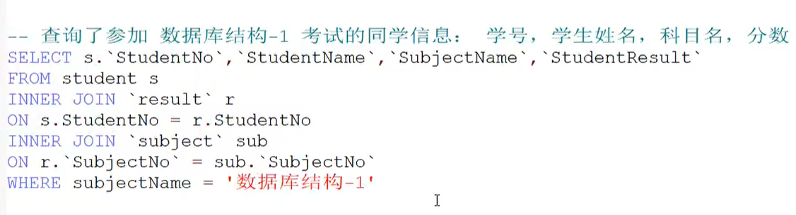

先将学生与其考过的试进行等值连接

再将这张临时表与的科目标号与科目名称等值连接

再取出相应需要的科目

#### 子查询

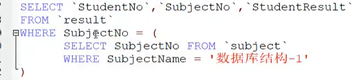

​	效果与上图相同

​	连接查询的效率更好一些，所以一般是建议把子查询改为连接查询

不相关：

​	指的是内层子查询与外层查询不相关，可以独立执行，返回确定的一个值或者一个集合。

子查询不能使用order by

##### 相关子查询

```mysql
-- 选学了1号课程的学生的学号，姓名和系别
SELECT s.Sno，Sname，Sdept
FROM student s 
JOIN sc ON s.Sno = sc.Sno 
JOIN course c ON sc.cno=c.cno
WHERE Cname = '1'
-- 相关子查询
SELECT s.Sno，Sname，Sdept
FROM student s
WHERE EXISTS(SELECT *
            FROM sc
            WHERE sc.Sno=student.Sno and cno='1')
```


#### 排序

##### 排序按降序排序（升序可以不写或者ASC）

```mysql
ORDER BY price DESC,
ORDER BY avg(price) DESC,
```

##### 中文会被转化成大写字母进行排序

```mysql
ORDER BY， Name DESC;
```

#### 几个示例

```mysql
查询男女学生的人数
SELECT s.sex, count(*)
FROM student
GROUP BY s.sex
查询每门课的选课人数，并列出选课人数小于15人的课程信息
SELECT cno, count(*)
FROM sc
GROUP BY cno
HAVING count(*)<15
SELECT son, avg(grade)
FROM sc
GROUP BY sno
HVAING count(cno)>3
```


#### 分组

```mysql
显示每个地区的总人口数和总面积．仅显示那些面积超过1000000的地区。
SELECT region, SUM(population), SUM(area)
FROM bbc
GROUP BY region
HAVING SUM(area)>1000000
```

​	HAVING子句可以让我们筛选成组后的各组数据． WHERE子句在聚合前先筛选记录

#### 分页

```mysql
LIMIT 0,5
(起始值，页面大小)
```

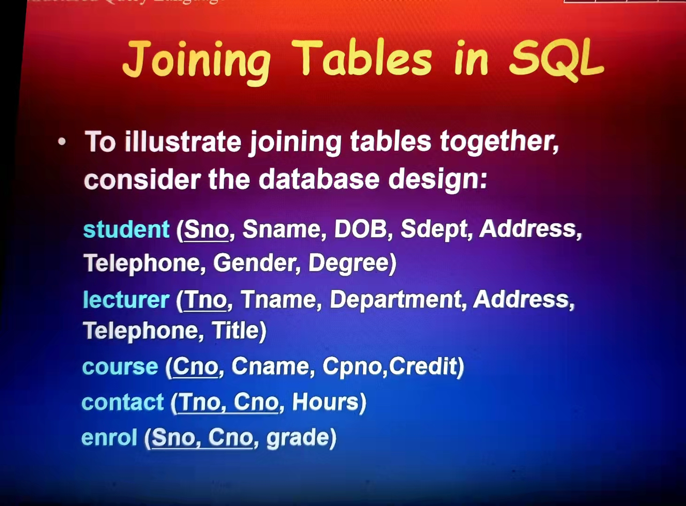

```mysql
SELECT Cno, avg(grade)
from sc
--where cno='c02'
GROUP by cno

HAVING avg(grade)<80
order by avg(grade) DESC
--------------------------------------------
SELECT Sname, Cno
FROM student, enrol
WHERE  student.sno = enrol.sno AND Sname = 'Jane Doe'
-- 上是89写法，下是92写法
SELECT Sname, Cno
FROM (student JOIN enrol
     ON student.sno = enrol.sno)
WHERE Sname = 'Jane Doe'
--------------------------------------------
SELECT Sno, Sname, Sdept
FROM (student s JOIN enrol e ON s.Sno=e.Sno)
WHERE cno = 'ACSC7101'

SELECT min(grade), max(grade), avg(grade)
FROM (enrol e JOIN course c ON e.Cno = c.Cno)
WHERE c.Cname = 'data structure'

SELECT avg(grade)
FROM (enrol e JOIN course c ON e.Cno = c.Cno)
WHERE c.Cname = 'C++' AND s.Sdept = 'MA'

-------------------------------------------
SELECT sname, grade
FROM student s JOIN enrol e ON s.sno=e.sno
WHERE cno='c02' AND enrol.grade>(SELECT AVG(grade)
                  				FROM enrol
                  				WHERE garde)
-- 查询选修了利用所选的某一门课的学生学号
SELECT sno
FROM sc
WHERE cno IN (SELECT cno
			FROM student s JOIN sc ON s.sno=sc.sno
			WHERE snma='liyong')
-- 查询选修了‘数据结构’，并且拿到该课程最高分的学生学号姓名和系别

SELECT max(e.grade)
FROM e.cno=(SELECT cname
           FROM course
           WHERE Cname='data structure')
           AND
           
SELECT Sno, Sname
FROM student s
WHERE s.sno=(SELECT sno
            FROM enrol
            WHERE grade > 85 and sno=(SELECT cno
                                     FROM lecture
                                     WHERE tname='database'))
--------------------------------------------------
SELECT Sname
FROM student s 
WHERE NOT EXISTS(SELECT *
            FROM enrol e
            WHERE e.Sno = s.Sno 
                 and e.Cno IN ('1','3','5','8')
              
-------------------------------------------------
SELECT ENAME
FROM ENP p LEFT JOIN EP j ON p.ENO=j.ENO
WHERE j.PNO is NULL AND p.DNO = (
SELECT p.DNO
FROM p
WHERE p.DNAME='工程部'
)
                 
```

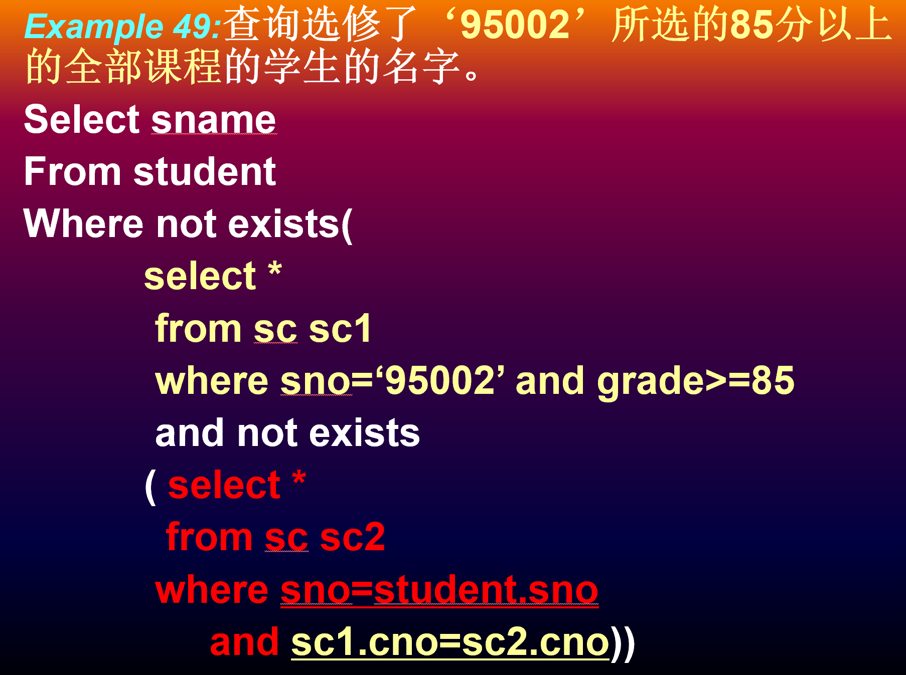


## 函数

https://dev.mysql.com/doc/refman/5.7/en/built-in-function-reference.html

| 函 数   | 说 明            |
| ------- | ---------------- |
| AVG()   | 返回某列的平均值 |
| COUNT() | 返回某列的行数   |
| MAX()   | 返回某列的最大值 |
| MIN()   | 返回某列的最小值 |
| SUM()   | 返回某列值之和   |

AVG() 会忽略 NULL 行。

##### SUM（）

- 如果在没有返回匹配行[SELECT](http://www.yiibai.com/mysql/select-statement-query-data.html)语句中使用`SUM`函数，则`SUM`函数返回`NULL`，而不是`0`。
- `DISTINCT`运算符允许计算集合中的不同值。
- `SUM`函数忽略计算中的`NULL`值。

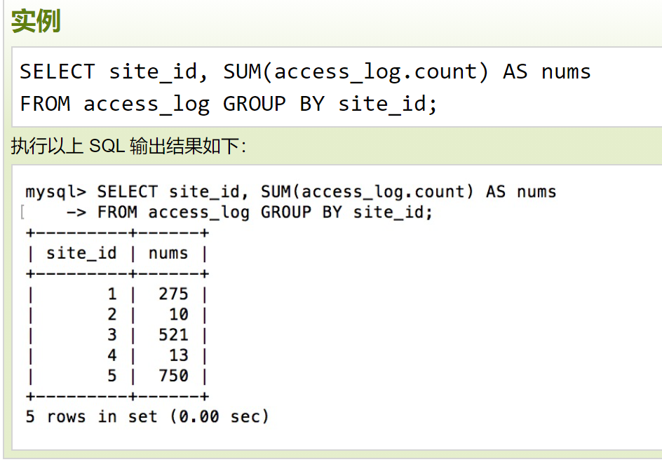

https://www.runoob.com/sql/sql-groupby.html

#### 字符串

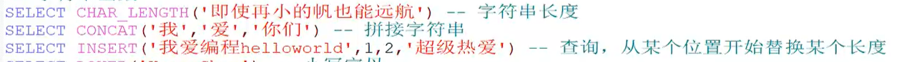


#### 聚合

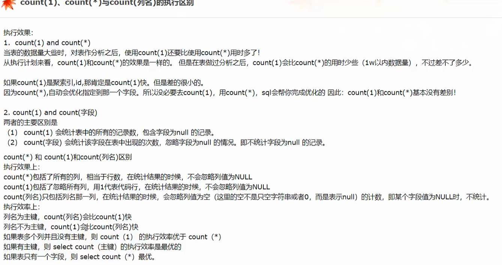

##### any_value()

​	如果是5.7版本以上的话，即使所有记录的ename的值都一样，也会出现这个错误。因为上面提到了如果ONLY_FULL_GROUP_BY模式开启，那么select target list中的所有列的值都必须有明确语义。其实例子中的ename对我们来说意义不大，我们完全可以将其从target list中移除。但是如果真实的业务场景中必须要查询这一项，那我们就可以使用any_value()函数。

​	any_value()会选择被分到同一组的数据里第一条数据的指定列值作为返回数据。

https://blog.csdn.net/Peacock__/article/details/90608246

#### MD5加密

https://blog.csdn.net/ztnhnr/article/details/108121771

### 关系代数

https://blog.csdn.net/qq_37521566/article/details/80854134

## 事务

### 原子性

​		整个事务中的所有操作，要么全部完成，要么全部不完成，不可能停滞在中间某个环节。事务在执行过程中发生错误，会被回滚（Rollback）到事务开始前的状态，就像这个事务从来没有执行过一样。

### 一致性

​		在事务开始之前和事务结束以后，数据库的完整性约束没有被破坏。

​		拿转账来说，假设用户A和用户B两者的钱加起来一共是5000，那么不管A和B之间如何转账，转几次账，事务结束后两个用户的钱相加起来应该还得是5000，这就是事务的一致性。

### 隔离性

​		隔离状态执行事务，使它们好像是系统在给定时间内执行的唯一操作。如果有两个事务，运行在相同的时间内，执行 相同的功能，事务的隔离性将确保每一事务在系统中认为只有该事务在使用系统。这种属性有时称为串行化，为了防止事务操作间的混淆，  必须串行化或序列化请 求，使得在同一时间仅有一个请求用于同一数据。

### 持久性

​		在事务完成以后，该事务所对数据库所作的更改便持久的保存在数据库之中，并不会被回滚。

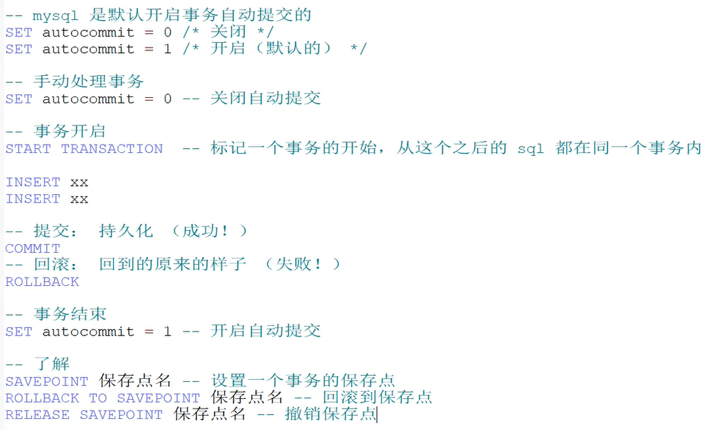

##### 一组事务

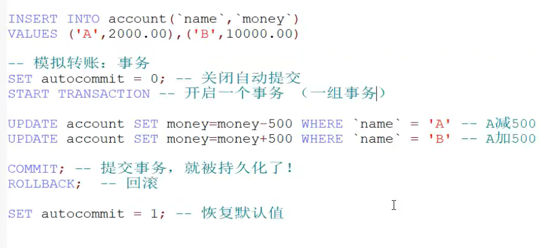

### 隔离级别

- Read uncommitted(读未提交)
- Read Committed(读已提交)
- Repeatable Reads(可重复读)
- Serializable(串行化)

https://blog.csdn.net/qq_33290787/article/details/51924963

https://www.zhihu.com/question/47007926

## 索引

https://blog.csdn.net/tongdanping/article/details/79878302/

#### 主键索引

即主索引，根据主键pk_clolum（length）建立索引，不允许重复，不允许空值；

ALTER TABLE 'table_name' ADD PRIMARY KEY pk_index('col')；

#### 唯一索引

用来建立索引的列的值必须是唯一的，允许空值

ALTER TABLE 'table_name' ADD UNIQUE index_name('col')；

#### 普通索引

用表中的普通列构建的索引，没有任何限制

ALTER TABLE 'table_name' ADD INDEX index_name('col')；

CREATE INDEX index_name ON 'table_name(`col`)'

#### 全文索引

用大文本对象的列构建的索引（下一部分会讲解）

ALTER TABLE 'table_name' ADD FULLTEXT INDEX ft_index('col')；

#### 组合索引

用多个列组合构建的索引，这多个列中的值不允许有空值

ALTER TABLE 'table_name' ADD INDEX index_name('col1','col2','col3')；

#### explain

https://blog.csdn.net/jiadajing267/article/details/81269067

### 索引原则


## 三大范式

#### 第一范式：列不可再分

1.每一列属性都是不可再分的属性值，确保每一列的原子性

2.两列的属性相近或相似或一样，尽量合并属性一样的列，确保不产生冗余数据

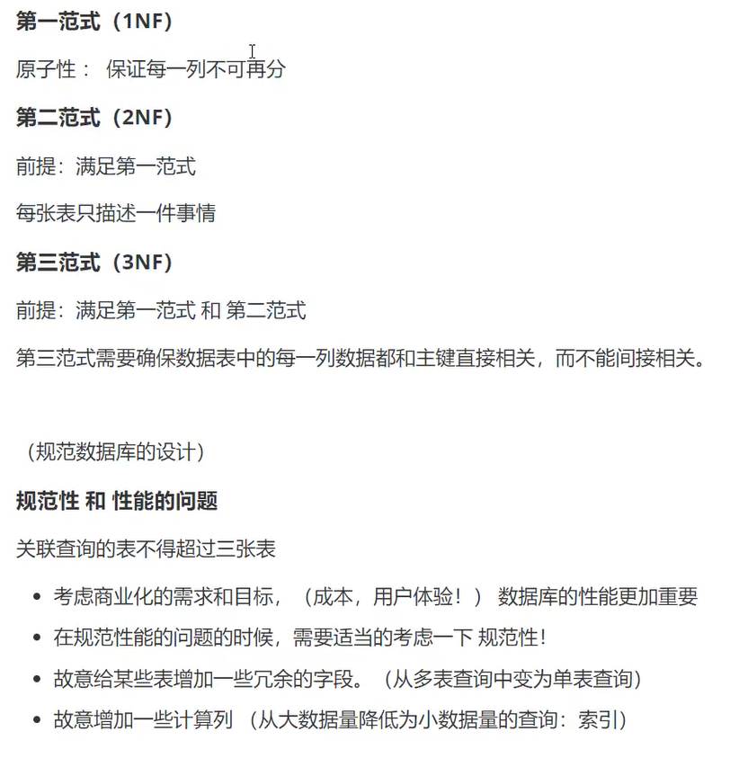

## 视图

建立信息系学术的视图

```
CREATE VIEW IS_Student(srudentID, Name, Age)
AS
SLELECT Sno，Sname,Sage
FROM Student
WHERE Sdept='IS'

SELECT * FROM IS_Student
```

#### WITH CHECK OPTION

加了WITH CHECK OPTION子句，以后对该视图进行插入、修改和删除操作时，DBMS会自动加上Sdept＝’IS’的条件

```
CREATE VIEW IS_Student(srudentID, Name, Age)
AS
SLELECT Sno，Sname,Sage
FROM Student
WHERE Sdept='IS'
WITH CHECK OPTION

-- 
```

DROP

```
DROP VIEW 'CS'
GO
```

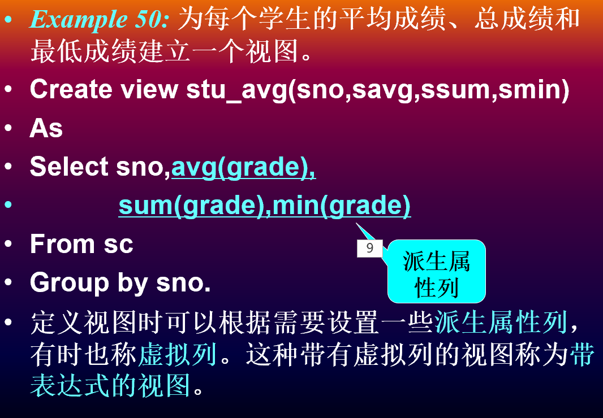

用虚拟列是view后的列属性字段不能省略

建立视图时，从基本表出来的数据最好不使用SELECT *，不然基本表的改变会影响视图。

### 授权

授予

```
GRANT SELECT, UPDATE(sdept)
ON student TO U1

GRANT ALL PRIVILEGES
ON student
TO U2


```

收回

```
REVOKE UPDATE(sdept)
ON student
FROM U1

REVOKE ALL PRIVILEGES
ON student
FROM U2 CASCADE
```

## ER图

### entity

矩形

**student**

### attribute

the **name** of a student

椭圆

#### composite attribute

#### simple attribute

#### multi-value attributes

双线

#### derived attributes

虚线椭圆

可以通过其他的attributes计算得到的 :年龄和出生日期都可以作为一个人的属性，但是出生日期是不变的，而年龄是可以通过计算得到的，

### relationships

菱形

student **enrols in** subject

三个二元关系不等价于一个三元关系

#### relationship participation

partial 单线

tatol 双线

### supertypes

## 数据库设计

