# JAVA WEB

### web服务器

将某个主机上的资源映射为一个URL供外界访问，接收和响应。

### 设计原则

#### 开闭原则

​		Software entities like classes,modules and functions should be open for extension but closed for modifications.

​		软件实体应该通过扩展来实现变化，而不是通过修改已有的代码来实现变化。

https://blog.csdn.net/hfreeman2008/article/details/52344022

https://www.cnblogs.com/shijingjing07/p/6227728.html

### How to access a website


### HTTP

#### get和post

https://blog.csdn.net/weixin_42276859/article/details/81433938

#### Cookie、session和localStorage、以及sessionStorage之间的区别

https://www.cnblogs.com/zr123/p/8086525.html

#### 三次握手和四次挥手

https://www.cnblogs.com/bj-mr-li/p/11106390.html

为什么不是两次握手而是三次

https://blog.csdn.net/lengxiao1993/article/details/82771768

### socket


### serverlet

#### tomcat与serverlet

https://www.cnblogs.com/llsblog/p/10634099.html

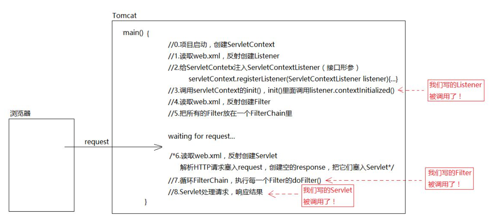

这篇讲的好棒！https://www.zhihu.com/question/21416727

#### Serverlet理解

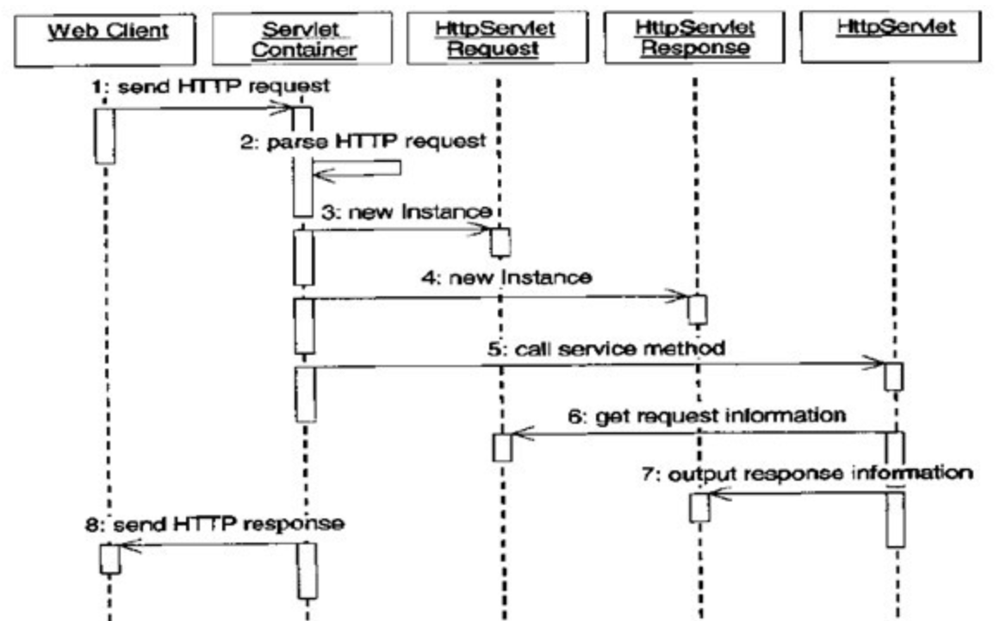

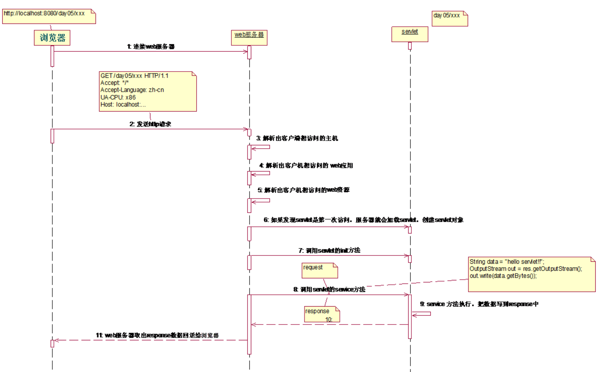

https://blog.csdn.net/weixin_42030522/article/details/85019169

​		处理请求的逻辑是不同的。所有抽取出来做成Servlet，交给程序员自己编写。

### HttpServlet

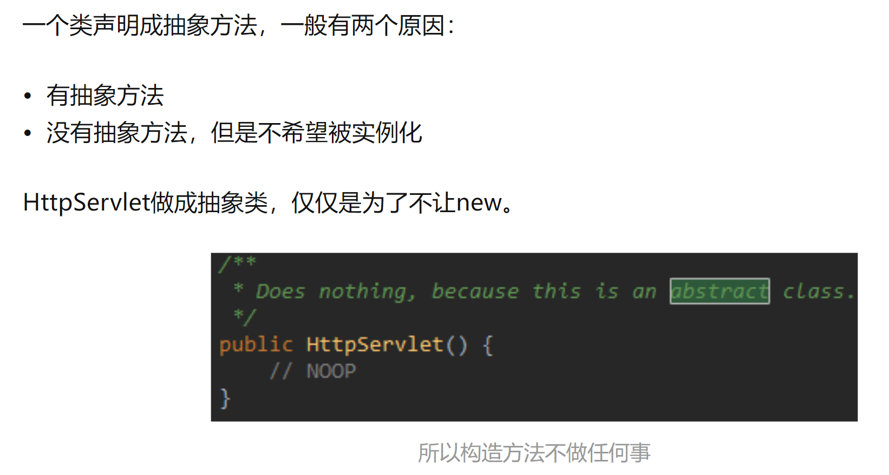

#### Servlet - Request、Session、servletContext区别

##### Request 

​		保存的键值仅在下一个request对象中可以得到。

##### Session    

​		它是一个会话范围，相当于一个局部变量，从Session第一次创建知道关闭，数据都一直 保存，每一个客户都有一个Session，所以它可以被客户一直访问，只要Session没有关闭和超时即浏览器关闭。

##### servletContext  

​		它代表了servlet环境的上下文，相当于一个全局变量，即只要某个web应用在启动中，这个对象就一直都有效的存在，所以它的范围是最大的，存储的数据可以被所有用户使用，只要服务器不关闭，数据就会一直都存在。

###### 域对象

​		域对象是服务器在内存上创建的存储空间，用于在不同动态资源（servlet）之间传递与共享数据。

###### Servlet上下文：

​		Servlet上下文提供对应用程序中所有Servlet所共有的各种资源和功能的访问。Servlet上下文API用于设置应用程序中所有Servlet共有的信息。Servlet可能需要共享他们之间的共有信息。运行于同一服务器的Servlet有时会共享资源，如JSP页面、文件和其他Servlet。

###### 举例：

​		如，做一个购物类的网站，要从数据库中提取物品信息，如果用session保存这些物品信息，每个用户都访问一便数据库，效率就太低了；所以要用来Servlet上下文来保存，在服务器开始时，就访问数据库，将物品信息存入Servlet上下文中，这样，每个用户只用从上下文中读入物品信息就行了。
https://blog.csdn.net/lvzhiyuan/article/details/4664624

#### servlet中getsession的用法

HttpSession session = request.getSession(false); HttpSession session = request.getSession(true); HttpSession session = request.getSession(); 这三种分别什么意思

getSession是返回当前用户的会话对象，参数的区别在于

​		参数为true，则如果“当前用户的会话对象”为空（第一次访问时）则创建一个新的会话对象返回

​		参数为false，则如果“当前用户的会话对象”为空，则返回null（即不自动创建会话对象）

​		注意request.getSession() 等同于 request.getSession(true)，除非我们确认session一定存在或者sesson不存在时明确有创建session的需要，否则请尽量使用request.getSession(false)。

### Filter

​		对从客户端向服务器端发送的请求进行过滤，也可以对服务器端返回的响应进行处理。

### **Servlet映射器**mapper

##### internalMap 

​		根据 name 字符串匹配 Host 和 Context，其中 Host 不区分大小写，Context 区分。

##### internalMapWrapper

1. **精确匹配**，查找一个与请求路径完全匹配的 Servlet
2. **前缀路径匹配**，递归的尝试匹配最长路径前缀的 Servlet，通过使用 "/" 作为路径分隔符，在路径树上一次一个目录的匹配，选择路径最长的
3. **扩展名匹配**，如果 URL 最后一部分包含扩展名，如 .jsp，则尝试匹配处理此扩展名请求的 Servlet
4. 如果前三个规则没有匹配成功，那么容器要为请求提供一个**默认 Servlet**

容器在匹配时区分大小写。

https://www.cnblogs.com/chuonye/p/10808765.html

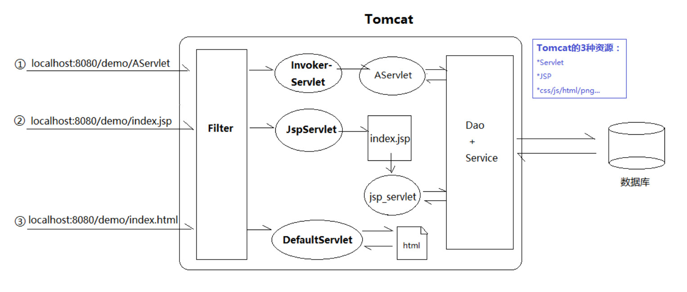

​		对于静态资源，Tomcat最后会交由一个叫做DefaultServlet的类来处理
​		对于Servlet ，Tomcat最后会交由一个叫做 InvokerServlet的类来处理
​		对于JSP，Tomcat最后会交由一个叫做JspServlet的类来处理

### 作用域

一、 生命周期：
page：存在page中的变量，只作用于当前的jsp页面，当发生跳转、重定向、定时刷新时，将随之销毁；
request：存在request中的变量，作用于一次HTTP请求到服务器处理结束，返回响应的整个过程，该变量可以随着forward的方式跳转到多个jsp中，一但刷新页面，它们将重新计算；
session：存在Session中的变量，作用于一次会话中，从打开浏览器到关闭浏览器过程中，将一直累加；（若想在再次打开浏览器时，变量仍然存在，则可以将session的JSESSIONID存到Cookie中，在给cookie一个存活时间）
application：存在application中的变量，作用于整个应用中，即从应用启动到应用结束，如果不进行手工删除，它们将一直可以使用，而且这些变量所有用户均可使用。

二、 作用范围：
page：用户请求的当前页面；
request：用户请求访问的当前组件，以及和当前web组件共享同一用户请求的web组件；
session：同一个Http会话中的web组件共享；
application：整个web应用的所有web组件共享，即只要是同一个服务器下的均可使用。
https://blog.csdn.net/huluwa10526/article/details/110424296

### 转发与重定向

​		当使用转发时，JSP容器将使用一个内部的方法来调用目标页面，新的页面继续处理同一个请求，而浏览器将不会知道这个过程。 与之相反，重定向方式的含义是第一个页面通知浏览器发送一个新的页面请求。


#### 转发的特点

1. 地址栏不发生变化，显示的是上一个页面的地址
2. 请求次数：只有1次请求
3. 根目录：http://localhost:8080/项目地址/，包含了项目的访问地址
4. 请求域中数据不会丢失

#### 重定向的特点

1. 地址栏：显示新的地址
2. 请求次数：2次
3. 根目录：http://localhost:8080/ 没有项目的名字
4. 请求域中的数据会丢失，因为是2次请求

### Java  Bean

- 这个Java类必须具有一个无参的构造函数
- 属性必须私有化。
- 私有化的属性必须通过public类型的方法暴露给其它程序，并且方法的命名也必须遵守一定的命名规范

​		JavaBean在J2EE开发中，通常用于封装数据，对于遵循以上写法的JavaBean组件，其它程序可以通过**反射技术**实例化JavaBean对象，并且通过反射那些遵守命名规范的方法，从而获知JavaBean的属性，进而调用其属性保存数据。

### jdk静态、动态代理

#### 静态代理

```java
Calculator calculator = new CalculatorProxy(new CalculatorImpl())
```

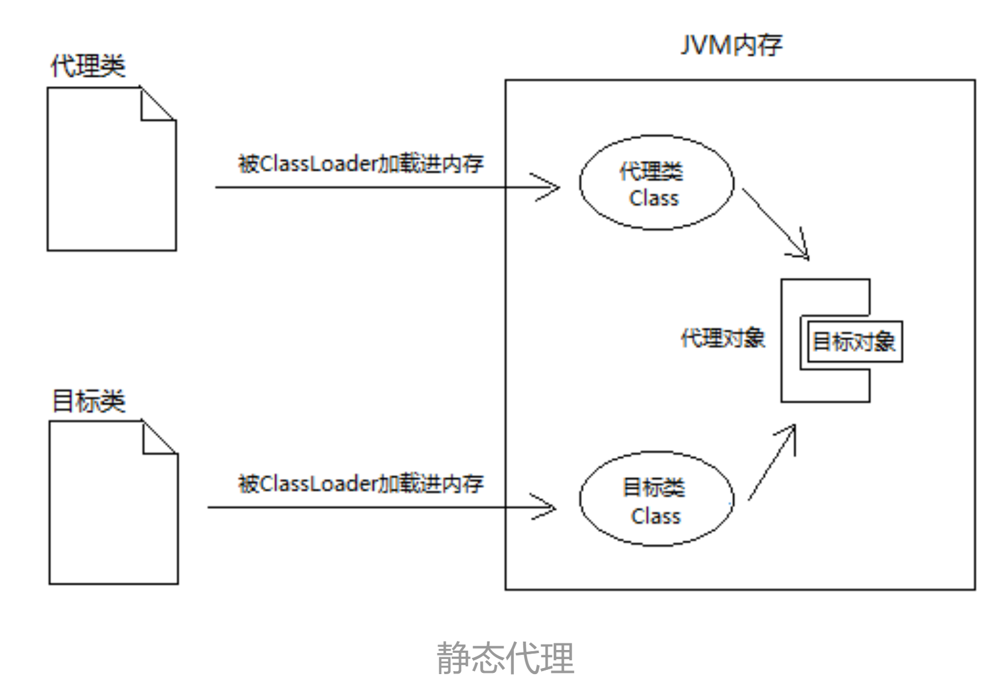


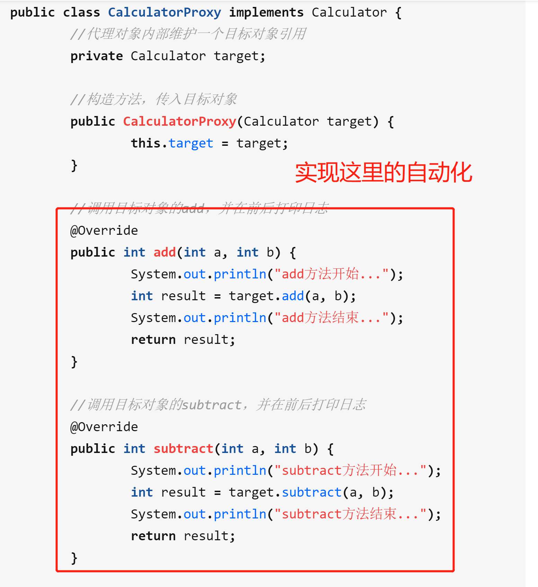

```java
public class Test {
	public static void main(String[] args) {
		//把目标对象通过构造器塞入代理对象
		Calculator calculator = new CalculatorProxy(new CalculatorImpl());
		//代理对象调用目标对象方法完成计算，并在前后打印日志
		calculator.add(1, 2);
		calculator.subtract(2, 1);
	}
}
```

​		

​		静态代理只符合开闭原则，但会存在很多的重复和硬编码，不利于维护。

​		如果现在我们系统需要全面改造，给其他类也添加日志打印功能，就得为其他几百个接口都各自写一份代理类。

​		所以，有没有一个方法，我传入接口，它就给我自动返回代理对象呢？

https://zhuanlan.zhihu.com/p/62534874

#### 动态代理

​		简而言之，为了不写代理类，却能完成代理功能。我们希望动态代理可以为接口类创建一个空的、可变的代理类（构造器及空方法等），再将实现类的方法的空方法自动写入，并自动为其添上头尾。

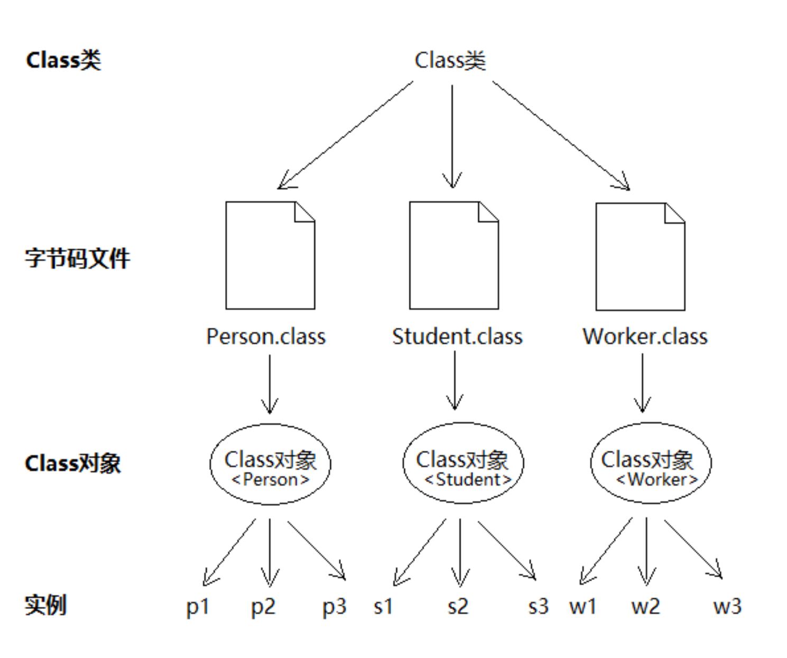

- 接口Class对象没有构造方法，所以Calculator接口不能直接new对象
- 实现类Class对象有构造方法，所以CalculatorImpl实现类可以new对象
- 接口Class对象有两个方法add()、subtract()
- 实现类Class对象除了add()、subtract()，还有从Object继承的方法

所以通过接口创建实例，就无法避开下面两个问题：

​		接口Class没有构造器，无法new。

​		因此有了getProxyClass()方法

​		只要传入目标类实现的接口的Class对象，getProxyClass()方法即可返回代理Class对象，而不用实际编写代理类。

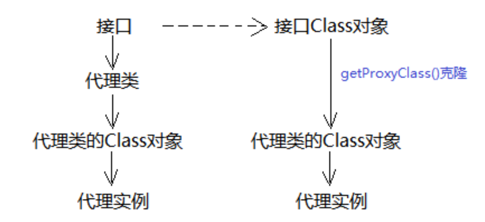

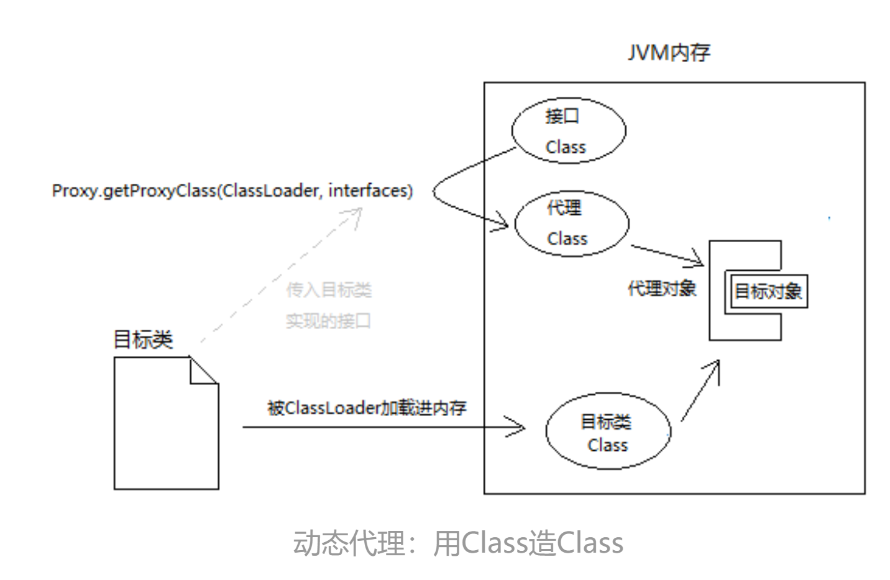

​		动态代理的大致实现设计思路：


这篇也是强烈推荐 https://zhuanlan.zhihu.com/p/62660956

​		因此现在只需要调用代理对象的方法时，去调用目标对象的方法。

​		但是，一个接口可以同时被多个类实现，所以JVM也无法判断当前代理对象想要代理哪个目标对象。

```java
public class ProxyTest {
	public static void main(String[] args) throws Throwable {
		CalculatorImpl target = new CalculatorImpl();
                //传入目标对象
                //目的：1.根据它实现的接口生成代理对象 2.代理对象调用目标对象方法
		Calculator calculatorProxy = (Calculator) getProxy(target);
		calculatorProxy.add(1, 2);
		calculatorProxy.subtract(2, 1);
	}

	private static Object getProxy(final Object target) throws Exception {
		//参数1：随便找个类加载器给它， 参数2：目标对象实现的接口，让代理对象实现相同接口
		Class proxyClazz = Proxy.getProxyClass(target.getClass().getClassLoader(), target.getClass().getInterfaces());
		Constructor constructor = proxyClazz.getConstructor(InvocationHandler.class);
		Object proxy = constructor.newInstance(new InvocationHandler() {
			@Override
			public Object invoke(Object proxy, Method method, Object[] args) throws Throwable {
				System.out.println(method.getName() + "方法开始执行...");
				Object result = method.invoke(target, args);
				System.out.println(result);
				System.out.println(method.getName() + "方法执行结束...");
				return result;
			}
		});
		return proxy;
	}
}
```

```java
public class ProxyTest {
	public static void main(String[] args) throws Throwable {
		CalculatorImpl target = new CalculatorImpl();
		Calculator calculatorProxy = (Calculator) getProxy(target);
		calculatorProxy.add(1, 2);
		calculatorProxy.subtract(2, 1);
	}

	private static Object getProxy(final Object target) throws Exception {
		Object proxy = Proxy.newProxyInstance(
				target.getClass().getClassLoader(),/*类加载器*/
				target.getClass().getInterfaces(),/*让代理对象和目标对象实现相同接口*/
				new InvocationHandler(){/*代理对象的方法最终都会被JVM导向它的invoke方法*/
					public Object invoke(Object proxy, Method method, Object[] args) throws Throwable {
						System.out.println(method.getName() + "方法开始执行...");
						Object result = method.invoke(target, args);
						System.out.println(result);
						System.out.println(method.getName() + "方法执行结束...");
						return result;
					}
				}
		);
		return proxy;
	}
}
```

### AOP

#### @Transactional 

​		当Spring读取到这个注解，便知道我们要使用事务。而我们编写的UserService类中并没有包含任何事务相关的代码。因此进行动态代理。

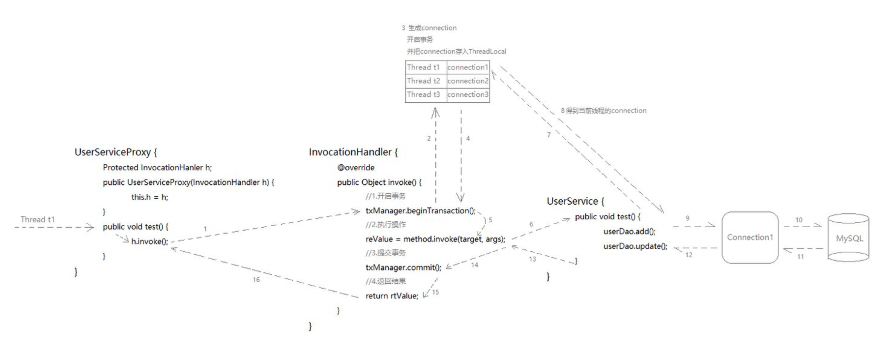

### IOC

https://www.zhihu.com/question/335362570

## Spring

#### 依赖注入

##### 构造器注入

默认使用无参构造。

有参构造的三种方式：

```xml
<bean id="exampleBean" class="examples.ExampleBean">    <constructor-arg type="int" value="7500000"/>    <constructor-arg type="java.lang.String" value="42"/> </bean>
```

如果有参构造里如果有多个重复的形参，那就按顺序写。

```xml
<bean id="exampleBean" class="examples.ExampleBean">    <constructor-arg index="0" value="7500000"/>    <constructor-arg index="1" value="42"/> </bean>
```

```xml
<bean id="exampleBean" class="examples.ExampleBean">    <constructor-arg name="years" value="7500000"/>    <constructor-arg name="ultimateAnswer" value="42"/> </bean>
```

https://docs.spring.io/spring-framework/docs/5.2.0.RELEASE/spring-framework-reference/core.html#beans-constructor-injectAutowon

由于没有setter方法，依赖关系在构造时由容器一次性设定，因此组件在被创建之后即处于
相对“不变”的稳定状态，无需担心上层代码在调用过程中执行setter方法对组件依赖关系
产生破坏，特别是对于Singleton模式的组件而言，这可能对整个系统产生重大的影响。

通过构造子注入，意味着我们可以在构造函数中决定依赖关系的注入顺序，对于一个大量
依赖外部服务的组件而言，依赖关系的获得顺序可能非常重要，比如某个依赖关系注入的
先决条件是组件的DataSource及相关资源已经被设定。（有一点像事务）

###### 默认单例模式

可以通过scope更改

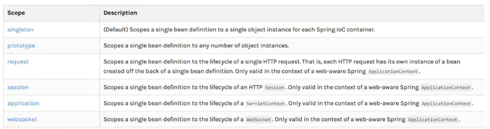

##### set注入

本质都是set注入。

设值 **注入** **是**指通过setter方法传入被调用者的实例。这种 **注入**方式简单、直观，因而在Spring的 **依赖** **注入**里大量使用。看下面代码， **是**Person的接口

//定义Person接口 public interface Person { //Person接口里定义一个使用斧子的方法 public void useAxe(); }


然后 **是**Axe的接口

//定义Axe接口 public interface Axe { //Axe接口里有个砍的方法 public void chop(); }


Person的实现类

```java
//Chinese实现Person接口  
public class Chinese implements Person { 
//面向Axe接口编程，而不是具体的实现类 
	private Axe axe; 
	//默认的构造器 public Chinese() {} 
	//设值**注入**所需的setter方法 
	public void setAxe(Axe axe) { this.axe = axe; } 
	//实现Person接口的useAxe方法 
	public void useAxe() { System.out.println(axe.chop()); } 
}
```


Axe的第一个实现类

```java
//Axe的第一个实现类 
StoneAxe  public class StoneAxe implements Axe { 
    //默认构造器 
    public StoneAxe() {} 
    //实现Axe接口的chop方法 
    public String chop() { return "石斧砍柴好慢"; } 
}
```


下面采用Spring的配置文件将Person实例和Axe实例组织在一起。配置文件如下所示:

```xml
<!-- 下面**是**标准的XML文件头 -->
<?xml version="1.0" encoding="gb2312"?> 
＜!-- 下面一行定义Spring的XML配置文件的dtd --＞ "http://www.springframework.org/dtd/spring-beans.dtd"＞ 
＜!-- 以上三行对所有的Spring配置文件都**是**相同的 --＞ 
＜!-- Spring配置文件的根元素 --＞ 
＜BEANS＞ 
＜!—定义第一bean，该bean的id**是**chinese, class指定该bean实例的实现类 --＞ 
＜BEAN class=lee.Chinese id=chinese＞ 
＜!-- property元素用来指定需要容器**注入**的属性，axe属性需要容器**注入**此处**是**设值**注入**，因此Chinese类必须拥有setAxe方法 --＞

＜property name="axe"＞ 
＜!-- 此处将另一个bean的引用**注入**给chinese bean --＞ 
＜REF local="”stoneAxe”/"＞ 
＜/property＞ 
＜/BEAN＞ 
＜!-- 定义stoneAxe bean --＞ 
＜BEAN class=lee.StoneAxe id=stoneAxe /＞ 
＜/BEANS＞
```


从配置文件中，可以看到Spring管理bean的灵巧性。bean与bean之间的 **依赖**关系放在配置文件里组织，而不是写在代码里。通过配置文件的 指定，Spring能精确地为每个bean **注入**属性。因此，配置文件里的bean的class元素，不能仅仅 **是**接口，而必须 **是**真正的实现类。

Spring会自动接管每个bean定义里的property元素定义。Spring会在执行无参数的构造器后、创建默认的bean实例后，调用对应 的setter方法为程序 **注入**属性值。property定义的属性值将不再由该bean来主动创建、管理，而改为被动接收Spring的 **注入**。

每个bean的id属性 **是**该bean的惟一标识，程序通过id属性访问bean，bean与bean的 **依赖**关系也通过id属性完成。

下面看主程序部分:

```java
public class BeanTest { 
	//主方法，程序的入口 
	public static void main(String[] args)throws Exception { 
		//因为**是**独立的应用程序，显式地实例化Spring的上下文。 
		ApplicationContext ctx = new FileSystemXmlApplicationContext("bean.xml"); 
		//通过Person bean的id来获取bean实例，面向接口编程，因此 
		//此处强制类型转换为接口类型 
		Person p = (Person)ctx.getBean("chinese"); 
		//直接执行Person的userAxe()方法。 
		p.useAxe(); } 
	}
}
```


程序的执行结果如下:

石斧砍柴好慢

主程序调用Person的useAxe()方法时，该方法的方法体内需要使用Axe的实例，但程序里没有任何地方将特定的Person实例和Axe实 例耦合在一起。或者说，程序里没有为Person实例传入Axe的实例，Axe实例由Spring在运行期间动态 **注入**。

Person实例不仅不需要了解Axe实例的具体实现，甚至无须了解Axe的创建过程。程序在运行到需要Axe实例的时候，Spring创建了Axe 实例，然后 **注入**给需要Axe实例的调用者。Person实例运行到需要Axe实例的地方，自然就产生了Axe实例，用来供Person实例使用。

https://blog.csdn.net/taijianyu/article/details/2338311?ivk_sa=1024320u

##### @Autowired

默认属性required是为true

使用注解须知： @Autowire默认使用Bytype,借助Qualifier可以指明bean id @Resource同时指定了Byname跟Bytype，如果两种都没有匹配，则需要使用name

其实在启动spring IoC时，容器自动装载了一个AutowiredAnnotationBeanPostProcessor后置处理器，当容器扫描到@Autowied、@Resource(是CommonAnnotationBeanPostProcessor后置处理器处理的)或@Inject时，就会在IoC容器自动查找需要的bean，并装配给该对象的属性

```
 <bean class="org.springframework.beans.factory.annotation.AutowiredAnnotationBeanPostProcessor"/>  
```

将使用有注解的构造函数进行Bean的初始化。那么，如果有两个@Autowired注解呢？结果肯定是报错，因为@Autowired的默认属性required是为true的，也就是说两个required=true的构造器，Spring不知道使用哪一个。但如果是这样写的话：

```Java
public ConstructorAutowiredTest() {
}

@Autowired(required = false)
public ConstructorAutowiredTest(User user) {
    this.user = user;
}

@Autowired(required = false)
public ConstructorAutowiredTest(User user, Role role) {
    this.user = user;
    this.role = role;
}
```

结果是怎样的呢？看看控制台打印：

使用参数最多的那一个构造器来初始化Bean。又如果两个有参构造器顺序调换又是怎样的呢？一个required为false一个为true，结果又是怎样的呢？这里直接给出答案，顺序调换依然使用多参数构造器，并且required只要有一个true就会报错。
https://blog.csdn.net/qq_41737716/article/details/85596817

 **注意事项：**

　　在使用@Autowired时，首先在容器中查询对应类型的bean

　　　　如果查询结果刚好为一个，就将该bean装配给@Autowired指定的数据

　　　　如果查询的结果不止一个，那么@Autowired会根据名称来查找。

　　　　如果查询的结果为空，那么会抛出异常。解决方法时，使用required=false

###### 存在的问题

@Autowired依赖注入不推荐了

基于 field 的注入，虽然不是绝对禁止使用，但是它可能会带来一些隐含的问题。来我们举个例子：

```java
@Autowired
private Person person;

private String company;

public UserServiceImpl(){
    this.company = person.getCompany();
}
```


初看起来好像没有什么问题，Person 类会被作为一个依赖被注入到当前类中，同时这个类的 company 属性将在初始化时通过person.getCompany() 方法来获得值。我们尝试运行一下就会发现报错了。

初看起来好像没有什么问题，Person 类会被作为一个依赖被注入到当前类中，同时这个类的 company 属性将在初始化时通过person.getCompany() 方法来获得值。我们尝试运行一下就会发现报错了。其实类似这个问题有人在stackoverflow上提问过，点我跳转。

Instantiation of bean failed; nested exception is org.springframework.beans.BeanInstantiationException: Failed to instantiate [...]: Constructor threw exception; nested exception is java.lang.NullPointerException
1

在执行this.company = person.getCompany();这段代码的时候报了空指针。

出现这个问题的原因是，Java 在初始化一个类时，是按照静态变量或静态语句块 –> 实例变量或初始化语句块 –> 构造方法 -> @Autowired 的顺序。所以在执行这个类的构造方法时，person 对象尚未被注入，它的值还是 null。
https://blog.csdn.net/zzming2012/article/details/117298095

##### @Component

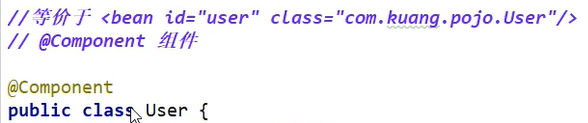

##### @Configuration

本质也是component

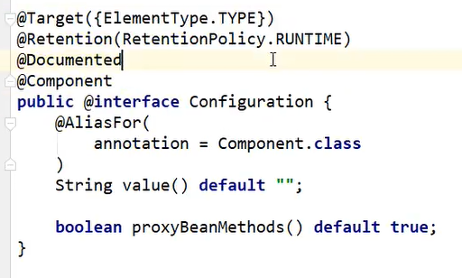

@Configuration注解中的bean如果没有被创建，创建后就会被spring容器一直管理，只要使用，都是直接从容器中获取。

@Component注解相当于每次用，每次都会去创建。可以使用@Autowired，那么原始的方法体会被执行并且结果对象会被注册到Spring上下文中，之后所有的对该方法的调用仅仅只是从Spring上下文中取回该对象返回给调用者。

https://www.cnblogs.com/cxy2020/p/14021985.html

##### @Configuration和@Bean

@Configuration可理解为用spring的时候xml里面的<beans>标签

@Bean可理解为用spring的时候xml里面的<bean>标签

@Bean 用在方法上，告诉Spring容器，你可以从下面这个方法中拿到一个Bean

https://blog.csdn.net/liuyinfei_java/article/details/82011805

### Spring实现AOP的两种方式

https://www.cnblogs.com/joy99/p/10941543.html

##### 注解实现

```java
AnnotationConfigApplicationContext context = new AnnotationConfigApplicationContext(AppConfig.class);
```

​		注意的是 `@Around` 修饰的环绕通知类型，是将整个目标方法封装起来了，在使用时，我们传入了 `ProceedingJoinPoint` 类型的参数，这个对象是必须要有的，并且需要调用 `ProceedingJoinPoint` 的 `proceed()` 方法。

```java

@Pointcut("execution(String com.sharpcj.aopdemo.test1.IBuy.buy(double)) && args(price) && bean(girl)")
public void gif(double price) {
}

@Around("gif(price)")
public String hehe(ProceedingJoinPoint pj, double price){
    try {
        pj.proceed();
        if (price > 68) {
            System.out.println("女孩买衣服超过了68元，赠送一双袜子");
            return "衣服和袜子";
        }
    } catch (Throwable throwable) {
        throwable.printStackTrace();
    }
    return "衣服";
}
```

###### 其中：

(ProceedingJoinPoint pj, double price)

pj.process()

这个就是jdk动态代理的

method.invoke(target, args)

##### proxyTargetClass

当这个参数为 false 时，
通过jdk的基于接口的方式进行织入，这时候代理生成的是一个接口对象，将这个接口对象强制转换为实现该接口的一个类，自然就抛出了上述类型转换异常。
反之，`proxyTargetClass` 为 `true`，则会使用 cglib 的动态代理方式。这种方式的缺点是拓展类的方法被`final`修饰时，无法进行织入。

###### 高版本spring自动根据运行类选择 JDK 或 CGLIB 代理：

- ```
  true
  ```

  - 目标对象实现了接口 – 使用`CGLIB`代理机制
  - 目标对象没有接口(只有实现类) – 使用`CGLIB`代理机制

- ```
  false
  ```

  - 目标对象实现了接口 – 使用`JDK`动态代理机制(代理所有实现了的接口)
  - 目标对象没有接口(只有实现类) – 使用`CGLIB`代理机制

XML实现：

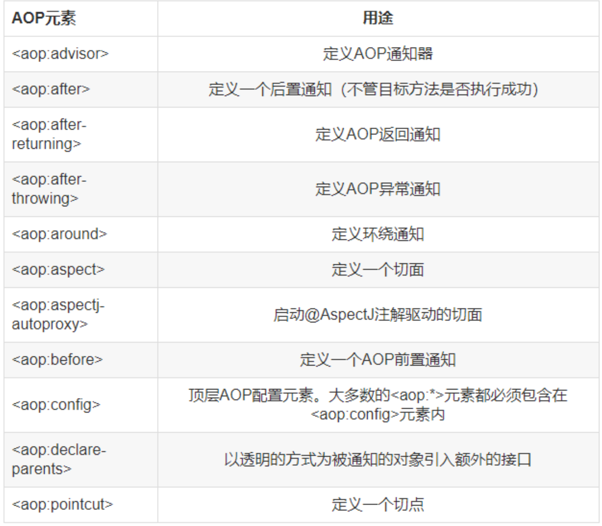

```java
ClassPathXmlApplicationContext context = new ClassPathXmlApplicationContext("aopdemo.xml");
```

```java
<?xml version="1.0" encoding="UTF-8"?>
<beans xmlns="http://www.springframework.org/schema/beans"
       xmlns:xsi="http://www.w3.org/2001/XMLSchema-instance" xmlns:aop="http://www.springframework.org/schema/aop"
       xsi:schemaLocation="http://www.springframework.org/schema/beans http://www.springframework.org/schema/beans/spring-beans.xsd http://www.springframework.org/schema/aop http://www.springframework.org/schema/aop/spring-aop.xsd">

    <bean id="boy" class="com.sharpcj.aopdemo.test2.Boy"></bean>
    <bean id="girl" class="com.sharpcj.aopdemo.test2.Girl"></bean>
    <bean id="buyAspectJ" class="com.sharpcj.aopdemo.test2.BuyAspectJ"></bean>

    <aop:config proxy-target-class="true">
        <aop:aspect id="qiemian" ref="buyAspectJ">
            <aop:before pointcut="execution(* com.sharpcj.aopdemo.test2.IBuy.buy(..))" method="hehe"/>
            <aop:after pointcut="execution(* com.sharpcj.aopdemo.test2.IBuy.buy(..))" method="haha"/>
            <aop:after-returning pointcut="execution(* com.sharpcj.aopdemo.test2.IBuy.buy(..))" method="xixi"/>
            <aop:around pointcut="execution(* com.sharpcj.aopdemo.test2.IBuy.buy(..))" method="xxx"/>
        </aop:aspect>
    </aop:config>
</beans>
```

### Bean


神文必看！https://blog.csdn.net/java_lyvee/article/details/101793774

#### Bean与new 对象

1、Spring是使用反射创建的对象，可指定对象的生命周期；如果是直接new的话就是直接创建一个对象。

2、Spring实现了对象池，一些对象创建和使用完毕之后不会被销毁，放进对象池（某种集合）以备下次使用，下次再需要这个对象，不new，直接从池里取，节省时间。

3、使用new关键字创建的对象属于强引用对象，所谓强引用，就是jvm垃圾回收机制永远不会回收这类对象，这时候需要手动移除引用。如果没有移除，这个对象将一直存在，久而久之，会引起内存泄露问题。

4、使用spring中的IOC就能很好的解决上述问题，使用IOC创建对象的时候，则无需关心由于创建对象的问题而引发的内存泄露问题。

5、spring之所以不用new对象是因为类的构造方法一旦被修改，new的对象就出错了，如果是用了spring，就不用理会构造方法是否被修改，而拿来用就可以。

https://blog.csdn.net/xhaimail/article/details/102833267

#### BeanFactory

BeanFactory是IOC容器的核心接口，它的职责包括：实例化、定位、配置应用程序中的对象及建立这些对象间的依赖。BeanFactory只是个接口，并不是IOC容器的具体实现，但是Spring容器给出了很多种实现，如 DefaultListableBeanFactory、XmlBeanFactory、ApplicationContext等，其中XmlBeanFactory就是常用的一个，该实现将以XML方式描述组成应用的对象及对象间的依赖关系。

可以把BeanFactory看成是图书馆，BeanDefinitionRegistry就是图书馆里边的书架，书就在书架上存放着，这里也就要求我们的图书馆只能有一个书架。每个BeanDefinition都要被放在BeanDefinitionRegistry中才能被容器管理。

BeanFactory提供的方法及其简单，仅提供了六种方法供客户调用：

- 　　boolean containsBean(String beanName) 判断工厂中是否包含给定名称的bean定义，若有则返回true
- 　　Object getBean(String) 返回给定名称注册的bean实例。根据bean的配置情况，如果是singleton模式将返回一个共享实例，否则将返回一个新建的实例，如果没有找到指定bean,该方法可能会抛出异常
- 　　Object getBean(String, Class) 返回以给定名称注册的bean实例，并转换为给定class类型
- 　　Class getType(String name) 返回给定名称的bean的Class,如果没有找到指定的bean实例，则排除NoSuchBeanDefinitionException异常
- 　　boolean isSingleton(String) 判断给定名称的bean定义是否为单例模式
- 　　String[] getAliases(String name) 返回给定bean名称的所有别名 

至于BeanDefinition，一般是通过BeanDefinitionReader读取配置文件并映射成对应的BeanDefinition来生成的。

**BeanFacotry是spring中比较原始的Factory。如XMLBeanFactory就是一种典型的BeanFactory。原始的BeanFactory无法支持spring的许多插件，如AOP功能、Web应用等。** 
**ApplicationContext接口,它由BeanFactory接口派生而来，ApplicationContext包含BeanFactory的所有功能，通常建议比BeanFactory优先**

https://www.cnblogs.com/tiancai/p/9604040.html

https://zhuanlan.zhihu.com/p/90586647	

#### FactoryBean

**一般情况下，Spring通过反射机制利用<bean>的class属性指定实现类实例化Bean，在某些情况下，实例化Bean过程比较复杂，如果按照传统的方式，则需要在<bean>中提供大量的配置信息。配置方式的灵活性是受限的，这时采用编码的方式可能会得到一个简单的方案。Spring为此提供了一个org.springframework.bean.factory.FactoryBean的工厂类接口，用户可以通过实现该接口定制实例化Bean的逻辑。FactoryBean接口对于Spring框架来说占用重要的地位，Spring自身就提供了70多个FactoryBean的实现**。它们隐藏了实例化一些复杂Bean的细节，给上层应用带来了便利。从Spring3.0开始，FactoryBean开始支持泛型，即接口声明改为FactoryBean<T>的形式

以Bean结尾，表示它是一个Bean，不同于普通Bean的是：它是实现了FactoryBean<T>接口的Bean，当在IOC容器中的通过反射机制发现Bean实现了FactoryBean接口后，通过getBean(String BeanName)获取到的Bean对象并不是FactoryBean的实现类对象，而是这个实现类中的getObject()方法返回的对象。要想获取FactoryBean的实现类，就要getBean(&BeanName)，在BeanName之前加上&。

```java
public class MyFactoryBean implements FactoryBean<Object>, InitializingBean, DisposableBean {

    private static final Logger logger = LoggerFactory.getLogger(MyFactoryBean.class);    
    private String interfaceName;    
    private Object target;    
    private Object proxyObj;    
    @Override
    public void destroy() throws Exception {
        logger.debug("destroy......");
    }
    @Override
    public void afterPropertiesSet() throws Exception {
        proxyObj = Proxy.newProxyInstance(
                this.getClass().getClassLoader(), 
                new Class[] { Class.forName(interfaceName) }, 
                new InvocationHandler() {                    
            @Override
            public Object invoke(Object proxy, Method method, Object[] args) throws Throwable {
                logger.debug("invoke method......" + method.getName());
                logger.debug("invoke method before......" + System.currentTimeMillis());
                Object result = method.invoke(target, args);
                logger.debug("invoke method after......" + System.currentTimeMillis());
                return result;            }            
        });
        logger.debug("afterPropertiesSet......");
    }

    @Override
    public Object getObject() throws Exception {
        logger.debug("getObject......");
        return proxyObj;
    }
```

​	

```xml
<bean id="fbHelloWorldService" class="com.ebao.xxx.MyFactoryBean">
    <property name="interfaceName" value="com.ebao.xxx.HelloWorldService" />
    <property name="target" ref="helloWorldService" />
</bean>
```

#### ApplicationContext

如果bean的scope是singleton的，并且lazy-init为false（默认是false，所以可以不用设置），则ApplicationContext启动的时候就实例化该Bean，并且将实例化的Bean放在一个map结构的缓存中，下次再使用该Bean的时候，直接从这个缓存中取；如果bean的scope是singleton的，并且lazy-init为true，则该Bean的实例化是在第一次使用该Bean的时候进行实例化；如果bean的scope是prototype的，则该Bean的实例化是在第一次使用该Bean的时候进行实例化

#### BeanDefinition


#### BeanFactoryPostProcessor

容器启动时会通过BeanDefinitionReader来加载配置文件获得对应BeanDefinition，然后将BeanDefinition注册到BeanDefinitionRegistry，BeanFactoryPostProcessor允许我们在上述第一个阶段结束对最后生成BeanDefinition做出修改。

```text
public interface BeanFactoryPostProcessor {
    void postProcessBeanFactory(ConfigurableListableBeanFactory var1) throws BeansException;
}
```

BeanFactoryProcessor接口很简单，只有一个方法，方法名字也很显义，即BeanFactory的后处理工作，那么参数中的BeanFactory就是我们要处理的BeanFactory了。

```text
// 这里我们使用BeanFactory的子接口
public interface BeanDefinitionRegistryPostProcessor extends BeanFactoryPostProcessor {
    void postProcessBeanDefinitionRegistry(BeanDefinitionRegistry var1) throws BeansException;
}

// 定义了一个继承自BeanDefinitionRegistryPostProcessor的处理器，作用是创建student的BeanDefinition并进行注册
public class BfProcessor implements BeanDefinitionRegistryPostProcessor {

    @Override
    public void postProcessBeanDefinitionRegistry(BeanDefinitionRegistry registry) throws BeansException {
        // 第一次从所有befinition中找不到student
        System.out.println(registry.getBeanDefinition("student"));
        // 创造student的beandefinition
        BeanDefinitionHolder holder = createBeanDefinition(Student.class.getName());
        // 注册
        BeanDefinitionReaderUtils.registerBeanDefinition(holder, registry);
        // 此时有了
        System.out.println(registry.getBeanDefinition("student"));
    }

    // 生产student的beandefinition
    private BeanDefinitionHolder createBeanDefinition(String className) {
        BeanDefinitionBuilder definition = BeanDefinitionBuilder.genericBeanDefinition(Student.class);
        definition.addPropertyValue("name", "ffbbb");
        return new BeanDefinitionHolder(definition.getBeanDefinition(), "student");
    }

    @Override
    public void postProcessBeanFactory(ConfigurableListableBeanFactory configurableListableBeanFactory) throws BeansException {
    }
}
```

我们在上边这段代码中定义了一个继承自 BeanDefinitionRegistryPostProcessor 的后处理器 BfProcessor，将它注册到容器中

```text
@Configuration
public class config {

    @Bean
    public User user(){
        return new User(100,"bbf");
    }

    @Bean
    public BfProcessor bfProcessor(){
        return new BfProcessor();
    }
}

@Data
public class Student {
    private String name;
}
```

同时可以看到，我们并没有把Student进行注册，所以正常情况下容器初始化完成不会有Student的，接着， 我们的后处理器开始发挥作用，在第一遍扫描不到student后开始生产student的beandefinition，然后注册到registry，所以第二次扫描时可以扫描到student的beandefinition，此时的beandefinition只是元数据，并没有被实例化还，正如我们前面说过的，还没到实例化的阶段，底下这一长行就是该beandefinition。

```text
Generic bean: class [com.example.springdemo.Bean.Student]; scope=; abstract=false; lazyInit=null; autowireMode=0; dependencyCheck=0; autowireCandidate=true; primary=false; factoryBeanName=null; factoryMethodName=null; initMethodName=null; destroyMethodName=null
```

https://zhuanlan.zhihu.com/p/90717151


#### BeanPostProcessor

BeanPostProcessor是在spring容器加载了bean的定义文件并且实例化bean之后执行的。BeanPostProcessor的执行顺序是在BeanFactoryPostProcessor之后。

3、下面通过完整的一个例子，来加深理解

1）定义一个JavaBean

```java
public class MyJavaBean implements InitializingBean {
    private String desc;
    private String remark;
    

    public MyJavaBean() {
        System.out.println("MyJavaBean的构造函数被执行啦");
    }
    public String getDesc() {
        return desc;
    }
    public void setDesc(String desc) {
        System.out.println("调用setDesc方法");
        this.desc = desc;
    }
    public String getRemark() {
        return remark;
    }
    public void setRemark(String remark) {
        System.out.println("调用setRemark方法");
        this.remark = remark;
    }
    public void afterPropertiesSet() throws Exception {
        System.out.println("调用afterPropertiesSet方法");
        this.desc = "在初始化方法中修改之后的描述信息";
    }
    public void initMethod() {
        System.out.println("调用initMethod方法");
    }
    public String toString() {
        StringBuilder builder = new StringBuilder();
        builder.append("[描述：").append(desc);
        builder.append("， 备注：").append(remark).append("]");
        return builder.toString();
    }

}
```

2）定义一个BeanFactoryPostProcessor

```java
public class MyBeanFactoryPostProcessor implements BeanFactoryPostProcessor {

    public void postProcessBeanFactory(ConfigurableListableBeanFactory beanFactory) throws BeansException {
        System.out.println("调用MyBeanFactoryPostProcessor的postProcessBeanFactory");
        BeanDefinition bd = beanFactory.getBeanDefinition("myJavaBean");
        MutablePropertyValues pv =  bd.getPropertyValues();  
        if (pv.contains("remark")) {  
            pv.addPropertyValue("remark", "在BeanFactoryPostProcessor中修改之后的备忘信息");  
        }  
    }

}
```

3）定义一个BeanPostProcessor

```java
public class MyBeanPostProcessor implements BeanPostProcessor {

    public Object postProcessBeforeInitialization(Object bean, String beanName) throws BeansException {
        System.out.println("BeanPostProcessor，对象" + beanName + "调用初始化方法之前的数据： " + bean.toString());
        return bean;
    }
    public Object postProcessAfterInitialization(Object bean, String beanName) throws BeansException {
        System.out.println("BeanPostProcessor，对象" + beanName + "调用初始化方法之后的数据：" + bean.toString());
        return bean;
    }

}
```

4）spring的配置

```xml
<?xml version="1.0" encoding="UTF-8" ?>
<beans xmlns="http://www.springframework.org/schema/beans"
	xmlns:xsi="http://www.w3.org/2001/XMLSchema-instance" xmlns:context="http://www.springframework.org/schema/context"
	xmlns:p="http://www.springframework.org/schema/p" xmlns:tx="http://www.springframework.org/schema/tx"
	xmlns:aop="http://www.springframework.org/schema/aop"
	xsi:schemaLocation="http://www.springframework.org/schema/beans http://www.springframework.org/schema/beans/spring-beans-2.5.xsd
				http://www.springframework.org/schema/context http://www.springframework.org/schema/context/spring-context-2.5.xsd
				http://www.springframework.org/schema/tx http://www.springframework.org/schema/tx/spring-tx-2.5.xsd"
	default-autowire="byName">
	

	<bean id="myJavaBean" class="com.ali.caihj.postprocessor.MyJavaBean" init-method="initMethod">
		<property name="desc" value="原始的描述信息" />
		<property name="remark" value="原始的备注信息" />
	</bean>
	
	<bean id="myBeanPostProcessor" class="com.ali.caihj.postprocessor.MyBeanPostProcessor" />
	<bean id="myBeanFactoryPostProcessor" class="com.ali.caihj.postprocessor.MyBeanFactoryPostProcessor" />

</beans>
```

5）测试类
```java
public class PostProcessorMain {
    public static void main(String[] args) {
        ApplicationContext context = new ClassPathXmlApplicationContext("config/postprocessor.xml");
        MyJavaBean bean = (MyJavaBean) context.getBean("myJavaBean");
        System.out.println("===============下面输出结果============");
        System.out.println("描述：" + bean.getDesc());
        System.out.println("备注：" + bean.getRemark());

    }

}
```

6）运行结果如下：

7）分析

从上面的结果可以看出，BeanFactoryPostProcessor在bean实例化之前执行，之后实例化bean（调用构造函数，并调用set方法注入属性值），然后在调用两个初始化方法前后，执行了BeanPostProcessor。初始化方法的执行顺序是，先执行afterPropertiesSet，再执行init-method。

https://blog.csdn.net/caihaijiang/article/details/35552859

### spring整合mybatis的两种方法

http://mybatis.org/spring/zh/sqlsession.html

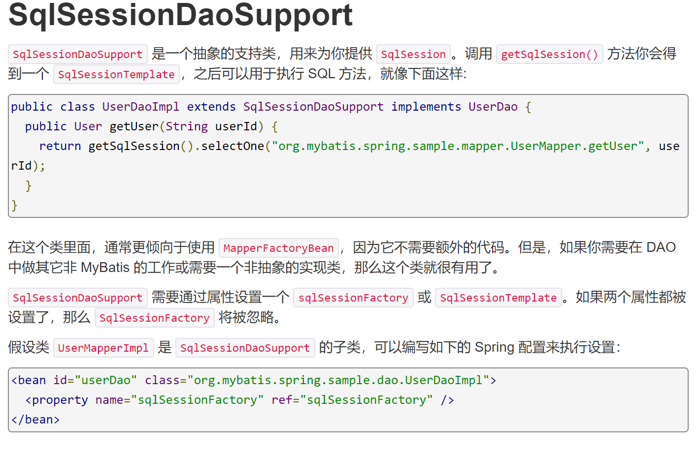

直接注入sqlSessionfactory是因为继承了父类的set方法

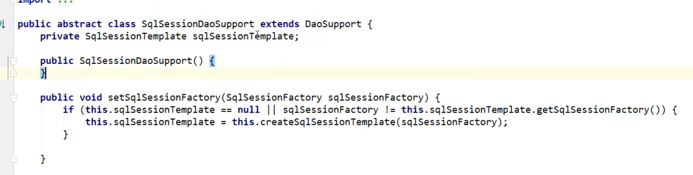

#### Spring整合事务

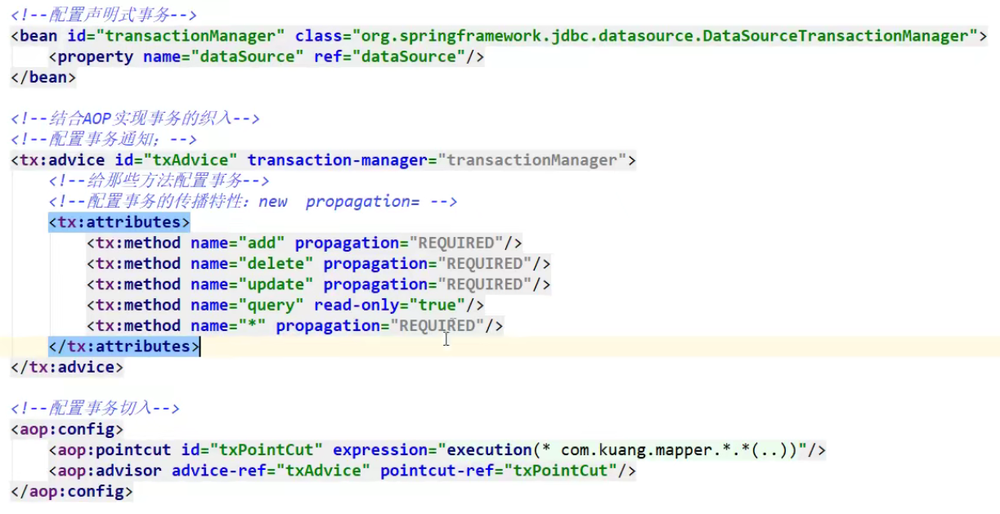

##### spring aop中的propagation的7种配置

https://www.cnblogs.com/sharpest/p/7719103.html

### SpringMVC


https://blog.csdn.net/x763795151/article/details/88427096

#### DispatcherServlet

##### HandlerMapping与HandlerExecutionChain

HandlerMapping是request与handler object之间的映射，它能根据request找到对应的handler。handler object总会被包装成HandlerExecutionChain ，HandlerExecutionChain 里含有handler object、interceptor等。
		HandlerMapping接口仅有一个方法getHandler，从方法注释中得知，handler object可以是任意类型，甚至都不需要实现标签接口，这样的好处是允许使用其他框架的handler object。
注意，在getHandler时，会进行content-type、参数、url、method等要素匹配，如果找不到对应的handler object（通常是@controller、@requestmapping注解的方法，也就是HandlerMethod），则会出抛出异常，返回404、405之类的状态码。

https://blog.csdn.net/wangjun5159/article/details/98849661

protected void doDispatch(HttpServletRequest request, HttpServletResponse response) throws Exception {
		
```java
			HandlerExecutionChain mappedHandler = null;
			mappedHandler = getHandler(processedRequest);
			if (mappedHandler == null || mappedHandler.getHandler() == null) {
				noHandlerFound(processedRequest, response);
				return;
			}

			// Determine handler adapter for the current request.
			HandlerAdapter ha = getHandlerAdapter(mappedHandler.getHandler());

			// Process last-modified header, if supported by the handler.
			String method = request.getMethod();
			boolean isGet = "GET".equals(method);
			if (isGet || "HEAD".equals(method)) {
				long lastModified = ha.getLastModified(request, mappedHandler.getHandler());
				if (logger.isDebugEnabled()) {
					logger.debug("Last-Modified value for [" + getRequestUri(request) + "] is: " + lastModified);
				}
			
			}

			if (!mappedHandler.applyPreHandle(processedRequest, response)) {
				return;
			}

			// Actually invoke the handler.
			mv = ha.handle(processedRequest, response, mappedHandler.getHandler());
}
```

根据request获取到HandlerExecutionChain ，根据HandlerExecutionChain 获取到handler，根据handler获取HandlerAdapter ，HandlerAdapter 判断文件是否被修改过，如果没修改过，直接返回。否则，HandlerExecutionChain 执行拦截器的prehandle方法，然后HandlerAdapter 执行实际处理。

##### load-on-startup

当值为0或者大于0时，表示容器在应用启动时就加载这个servlet；

当是一个负数时或者没有指定时，则指示容器在该servlet被选择时才加载。

#### Spring 配置中 bean 的 class

#### SpringMVC配置文件配置

```xml
<?xml version="1.0" encoding="UTF-8"?>
<beans xmlns="http://www.springframework.org/schema/beans"
       xmlns:xsi="http://www.w3.org/2001/XMLSchema-instance"
       xsi:schemaLocation="http://www.springframework.org/schema/beans
       http://www.springframework.org/schema/beans/spring-beans.xsd">

    <bean class="org.springframework.web.servlet.handler.BeanNameUrlHandlerMapping"/>
    <bean class="org.springframework.web.servlet.mvc.SimpleControllerHandlerAdapter"/>
    <bean class="org.springframework.web.servlet.view.InternalResourceViewResolver" id="internalResourceViewResolver">
        <property name="prefix" value="/WEB-INF/jsp/"/>
        <property name="suffix" value=".jsp"/>
    </bean>
    <bean id="/hello" class="cn.sy.controller.HelloController"/>
</beans>
```

这种情况下一个bean控制的类里只能写1个方法

```java
public class HelloController implements Controller {

    public ModelAndView handleRequest(HttpServletRequest request, HttpServletResponse response) throws Exception {
        ModelAndView mv = new ModelAndView();

        String result = "Hello";
        mv.addObject("msg", result);
        mv.setViewName("test");

        return mv;
    }
}
```

#### SpringMVC注解配置

```xml
<?xml version="1.0" encoding="UTF-8"?>
<beans xmlns="http://www.springframework.org/schema/beans"
       xmlns:xsi="http://www.w3.org/2001/XMLSchema-instance"
       xmlns:mvc="http://www.springframework.org/schema/mvc"
       xmlns:context="http://www.springframework.org/schema/context"
       xsi:schemaLocation="http://www.springframework.org/schema/beans
           http://www.springframework.org/schema/beans/spring-beans.xsd
           http://www.springframework.org/schema/context
           https://www.springframework.org/schema/context/spring-context.xsd
           http://www.springframework.org/schema/mvc
           https://www.springframework.org/schema/mvc/spring-mvc.xsd">

    <context:component-scan base-package="cn.sy.controller"/>
    <mvc:default-servlet-handler/>
    <mvc:annotation-driven/>

<!--    <bean class="org.springframework.web.servlet.handler.BeanNameUrlHandlerMapping"/>-->
<!--    <bean class="org.springframework.web.servlet.mvc.SimpleControllerHandlerAdapter"/>-->
    <bean class="org.springframework.web.servlet.view.InternalResourceViewResolver" id="internalResourceViewResolver">
        <property name="prefix" value="/WEB-INF/jsp/"/>
        <property name="suffix" value=".jsp"/>
    </bean>
</beans>
```

##### @Controller

实现控制器功能

##### @RequestMapping

实现路由

```java
@Controller
public class HelloController {
    @RequestMapping("/hello")
    public String hello(Model model){
        model.addAttribute("msg", "hello,Annotation");
        return "hello";
    }
}
/*return的值与
        <bean class="org.springframework.web.servlet.view.InternalResourceViewResolver" id="internalResourceViewResolver">
        <property name="prefix" value="/WEB-INF/jsp/"/>
        <property name="suffix" value=".jsp"/>
    </bean>
有关，在这里被拼接*/
```

@RequestMapping的参数method可以约束请求的方式

例如method={RequestMethod.POST}

可以用@PostMapping代替

##### @PathVariable

```java
将URL中占位符参数{xxx}绑定到处理器类的方法形参中@PathVariable(“xxx“) 
@RequestMapping(value=”user/{id}/{name}”)
请求路径：http://localhost:8080/hello/show5/1/james


    @RequestMapping("show5/{id}/{name}")
    public ModelAndView test5(@PathVariable("id") Long ids ,@PathVariable("name") String names){
        ModelAndView mv = new ModelAndView();
        mv.addObject("msg","占位符映射：id:"+ids+";name:"+names);
        mv.setViewName("hello2");
        return mv;
    }
```

https://blog.csdn.net/sswqzx/article/details/84194979

可以使用@PathVariable Map<A,B> 

来接收所有参数

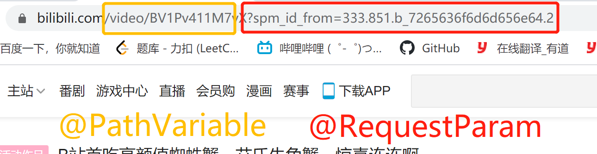

##### @RequestParam

指定从前端接收的参数

```java
@RequestMapping("/t1")
public String test1(int id, @RequestParam("username") String name, int age){
    System.out.println(name);
    System.out.println(id);
    System.out.println(age);
    return "hello";
}

@RequestMapping("/t2")
public String test2(User user){
    System.out.println(user);
    return "hello";
}
//这两个作用是一样的
```


##### @RequestAttribute

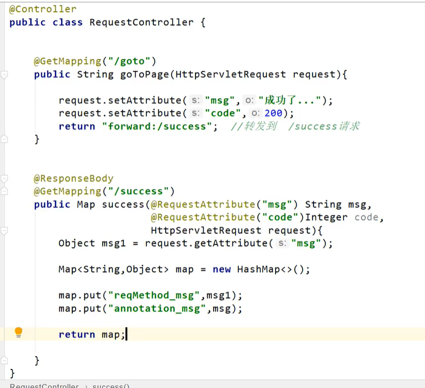

##### @AliasFor

Java语言中，注解是不能被继承的。这意味着，在组合注解时，我们无法覆盖元注解中的属性，灵活性很差。

```java
/**
 * 使用元注解Configuration和ImportResource创建了组合
 * 注解ImportResourceConfiguration，但是我们无法自由
 * 指定配置文件的位置。
 */
@Configuration
@Target(ElementType.METHOD)
@Retention(RetentionPolicy.RUNTIME)
@ImportResource("classpath:test.properties")
public @interface ImportResourceConfiguration {
}
```

引入`AliasFor`以后，让原本不存在层次结构的注解体系也拥有了层次的概念。换个角度思考一下，`AliasFor`的别名机制其实是一种属性重写，因为作为别名的属性是可以无缝替换源属性的，和继承中重写的概念很像不是吗？

```java
/**
 * 使用AliasFor改造以后，组合注解的value属性重写了
 * 元注解ImportResource注解的value属性，通过设置
 * 重写的属性就可以自由指定配置文件的位置了
 */
@Configuration
@Target(ElementType.METHOD)
@Retention(RetentionPolicy.RUNTIME)
@ImportResource
public @interface ImportResourceConfiguration {
  /**
   * 对value的设置会反应到ImportResource#value()
   */
  @AliasFor(attribute = "value", annotation = ImportResource.class)
  String[] value() default {};
}
```

这个讲源码https://www.jianshu.com/p/9cb0d7bf3141

**1. 在同一个注解中显示使用，将注解中的多个属性互相设置别名**

```java
@Target({ElementType.TYPE, ElementType.METHOD})
@Retention(RetentionPolicy.RUNTIME)
@Documented
@Mapping
public @interface RequestMapping {
    
	@AliasFor("path")
	String[] value() default {};

	@AliasFor("value")
	String[] path() default {};
    
    //...
}
```

为什么要给 value 属性和 path 属相互相设置别名也是有原因的。我们知道在 Spring 中给 value 属性设置值是可以省略属性的，比如可以写成：

```java
RequestMapping("/foo")
```

这样写比较简洁，但是这样可读性不高，我们并不知道 value 属性代表什么意思。如果给这个属相设置一个 path 别名的话我们就知道这个是在设置路径。

但是要注意一点，@AliasFor 标签有一些使用限制：

- 互为别名的属性属性值类型，默认值，都是相同的；
- 互为别名的注解必须成对出现，比如 value 属性添加了[@AliasFor](https://github.com/AliasFor)(“path”)，那么 path 属性就必须添加[@AliasFor](https://github.com/AliasFor)(“value”)；
- 另外还有一点，互为别名的属性必须定义默认值。

那么如果违反了别名的定义，在使用过程中就会报错。

**2. 给元注解中的属性设定别名**

先看ComponentScan

```java
public @interface ComponentScan {
    @AliasFor("basePackages")
    String[] value() default {};
    
    @AliasFor("value")
    String[] basePackages() default {};
    
    boolean lazyInit() default false;
    ...
}
```

ComponentScan中的value和basePackages作用是一样的。

```java
@ComponentScan("com.binecy")
public class SimpleAlias {

    public static void main(String[] args) {
        ComponentScan ann = AnnotationUtils.getAnnotation(SimpleAlias.class, ComponentScan.class);
        System.out.println(ann.value()[0]);
        System.out.println(ann.basePackages()[0]);
    }
}
```

@SpringBootApplication注解，等于@EnableAutoConfiguration，@ComponentScan，@SpringBootConfiguration三个注解的组合。
Spring是怎样将三个注解的整合到一个注解的呢？
这就要说到@AliasFor了

```java
@Target(ElementType.TYPE)
@Retention(RetentionPolicy.RUNTIME)
@Documented
@Inherited
@SpringBootConfiguration
@EnableAutoConfiguration
@ComponentScan(excludeFilters = { @Filter(type = FilterType.CUSTOM, classes = TypeExcludeFilter.class),
		@Filter(type = FilterType.CUSTOM, classes = AutoConfigurationExcludeFilter.class) })
public @interface SpringBootApplication {

	@AliasFor(annotation = EnableAutoConfiguration.class)
	Class<?>[] exclude() default {};

	@AliasFor(annotation = EnableAutoConfiguration.class)
	String[] excludeName() default {};
    
	@AliasFor(annotation = ComponentScan.class, attribute = "basePackages")
	String[] scanBasePackages() default {};
    //...
}
```

我们来看 @SpringBootApplication 这个注解，这个注解是有其他几个注解“组合”而成的。下面的代码就是在给@ComponentScan 注解的basePackages属性设置别名scanBasePackages。如果不设置attribute属性的话就是在给元注解的同名属性设置别名。

```java
@AliasFor(annotation = ComponentScan.class, attribute = "basePackages")
String[] scanBasePackages() default {};
```

这种使用方式的好处是可以将几个注解的功能组合成一个新的注解

其实看这一篇就够了https://segmentfault.com/a/1190000022613166?utm_source=tag-newest

https://www.cnblogs.com/54chensongxia/p/14385621.html

##### @Repeatable

@Repeatable注解是jdk8新增的注解，可以将多个注解替换为一个数组注解

```less
@Repeatable(ComponentScans.class)
public @interface ComponentScan {
...
}

@Retention(RetentionPolicy.RUNTIME)
@Target(ElementType.TYPE)
public @interface ComponentScans {
    ComponentScan[] value();
}
```

ComponentScans中values属性是一个ComponentScan数组，这里@Repeatable表示当配置了多个@ComponentScan时，@ComponentScan可以被@ComponentScans代替（jdk8中支持重复的注解）

```d
@ComponentScan("com.binecy.bean")
@ComponentScan("com.binecy.service")
public class ComponentScansService {
    public static void main(String[] args) {
        ComponentScans scans = ComponentScansService.class.getAnnotation(ComponentScans.class);
        for (ComponentScan componentScan : scans.value()) {
            System.out.println(componentScan.value()[0]);
        }
    }
}
```

ComponentScansService 上配置了两个ComponentScan，这时两个@ComponentScan可以被解析@ComponentScans。

https://segmentfault.com/a/1190000022613166?utm_source=tag-newest

##### @RestController

@RestController注解相当于@ResponseBody ＋ @Controller合在一起的作用。

### Spring配置编码过滤器

```xml
<filter>
    <filter-name>encoding</filter-name>
    <filter-class>org.springframework.web.filter.CharacterEncodingFilter</filter-class>
    <init-param>
        <param-name>encoding</param-name>
        <param-value>utf-8</param-value>
    </init-param>
</filter>
<filter-mapping>
    <filter-name>encoding</filter-name>
    <url-pattern>/*</url-pattern>
</filter-mapping>
```

## SpringBoot

#### pom

<parent>和<modules>

https://blog.csdn.net/isea533/article/details/73744497/

spingboot中已经配置了很多的很多已经管理好的配置

#### @SpringBootApplication

scanBasePackages

配置包扫描的范围

默认主类包已下

#### 配置Bean

```java
@Configuration(proxyBeanMethods = ture/false)
// 默认ture
public class Myconfig {
    
    @Bean("自定义名字")
    public User user01(){
        return new User("zhangsan", 24);
    }
}
```

https://www.jianshu.com/p/98ab442fe616

##### @import

```
@Import({DBHelper.class})
//cn.sy.boot.bean.User
//给容器中自动创建出组件,默认组件的名字就是全类名
```

#### @Conditional

```java
@ConditionalOnBean(name = "User")
```

存在这个Bean时这个类或者方法才会执行

#### @ImportResource

导入xml文件配置

不使用@ImportResource()注解，程序根本不能对我们spring的配置文件进行加载，所以我们需要将spring配置文件加载到容器里。

https://blog.csdn.net/weixin_44893467/article/details/107106180

#### @ConfigurationProperties

@ConfigurationProperties(prefix = "propertisename")

#### @EnableAutoConfiguration

```java
@AutoConfigurationPackage
@Import(AutoConfigurationImportSelector.class)
public @interface EnableAutoConfiguration {}
```

##### @AutoConfigurationPackage

自动配置包？指定了默认的包规则

```java
@Import(AutoConfigurationPackages.Registrar.class)  //给容器中导入一个组件
public @interface AutoConfigurationPackage {}

//利用Registrar给容器中导入一系列组件
//将指定的一个包下的所有组件导入进来？MainApplication 所在包下。
```

##### @Import(AutoConfigurationImportSelector.class)

```java
1、利用getAutoConfigurationEntry(annotationMetadata);给容器中批量导入一些组件
2、调用List<String> configurations = getCandidateConfigurations(annotationMetadata, attributes)获取到所有需要导入到容器中的配置类
3、利用工厂加载 Map<String, List<String>> loadSpringFactories(@Nullable ClassLoader classLoader)；得到所有的组件
4、从META-INF/spring.factories位置来加载一个文件。
	默认扫描我们当前系统里面所有META-INF/spring.factories位置的文件
    spring-boot-autoconfigure-2.3.4.RELEASE.jar包里面也有META-INF/spring.factories
    
```

#### @Scope

@Scope注解的定义信息，其共有三个方法，分别为value、scopeName、proxyMode，其中value和scopeName利用了Spring的显性覆盖，这两个方法的作用是一样的，只不过scopeName要比value更具有语义性。重点是proxyMode方法，其默认值为ScopedProxyMode.DEFAULT。

ScopedProxyMode是一个枚举类，该类共定义了四个枚举值，分别为NO、DEFAULT、INTERFACE、TARGET_CLASS，其中DEFAULT和NO的作用是一样的。INTERFACES代表要使用JDK的动态代理来创建代理对象，TARGET_CLASS代表要使用CGLIB来创建代理对象。

https://blog.csdn.net/m0_43448868/article/details/111643397

注解默认为singleton实例

@Scope("prototype")//多实例，IOC容器启动创建的时候，并不会创建对象放在容器在容器当中，当你需要的时候，需要从容器当中取该对象的时候，就会创建。

只要id与该bean定义相匹配，则只会返回bean的同一实例。

@Scope("singleton")//单实例 IOC容器启动的时候就会调用方法创建对象，以后每次获取都是从容器当中拿同一个对象（map当中）。

@Scope("request")//同一个请求创建一个实例

@Scope("session")//同一个session创建一个实例

几乎90%以上的业务使用**singleton**单实例就可以，所以spring默认的类型也是singleton，singleton虽然保证了全局是一个实例，对性能有所提高，但是如果实例中有非静态变量时，**会导致线程安全问题**，共享资源的竞争

当设置为**prototype**时：每次连接请求，都会生成一个bean实例，也会导致一个问题，当请求数越多，**性能会降低**，因为创建的实例，导致GC频繁，gc时长增加

https://blog.51cto.com/u_4247649/2118351

##### 单例Bean与单例模式的区别

单例模式是指在一个JVM进程中仅有一个实例，而Spring单例是指一个Spring Bean容器(ApplicationContext)中仅有一个实例

#### 按需开启自动配置项

虽然我们127个场景的所有自动配置启动的时候默认全部加载。xxxxAutoConfiguration
按照条件装配规则（@Conditional），最终会按需配置。
● 每个自动配置类按照条件进行生效，默认都会绑定配置文件指定的值。xxxxProperties里面拿。xxxProperties和配置文件进行了绑定
● 生效的配置类就会给容器中装配很多组件
● 只要容器中有这些组件，相当于这些功能就有了
● 定制化配置
  ○ 用户直接自己@Bean替换底层的组件
  ○ 用户去看这个组件是获取的配置文件什么值就去修改。
xxxxxAutoConfiguration ---> 组件  ---> xxxxProperties里面拿值  ----> application.properties

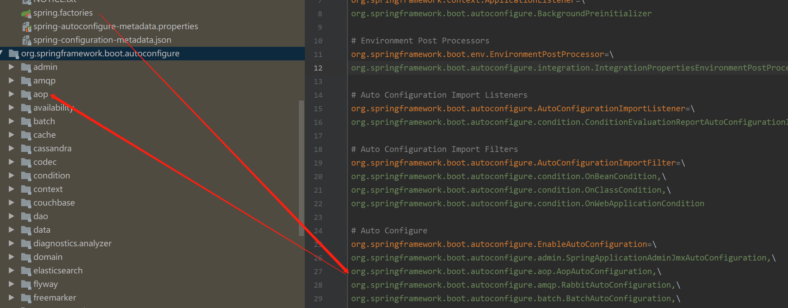

### yaml

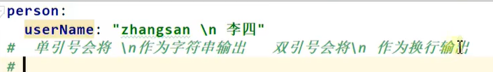

### /、/*和/**的区别


https://liuxingchang.blog.csdn.net/article/details/109016430?spm=1001.2101.3001.6661.1&utm_medium=distribute.pc_relevant_t0.none-task-blog-2%7Edefault%7ECTRLIST%7Edefault-1.no_search_link&depth_1-utm_source=distribute.pc_relevant_t0.none-task-blog-2%7Edefault%7ECTRLIST%7Edefault-1.no_search_link

### SpringBoot静态资源访问

只要静态资源放在类路径下： called /static (or /public or /resources or /META-INF/resources

访问 ： 当前项目根路径/ + 静态资源名 


原理： 静态映射/**。

请求进来，先去找Controller看能不能处理。不能处理的所有请求又都交给静态资源处理器。静态资源也找不到则响应404页面

改变默认的静态资源路径

YAML

复制代码

```yaml
spring:
  mvc:
    static-path-pattern: /res/**

  resources:
    static-locations: [classpath:/haha/]
```

如果静态资源名重复则按:

```
classpath:/META-INf/resources/
classpath: /resources/
classpath:/static
classpath:/public
```

的优先级使用

### 自定义RequestMappingHandlerMapping

https://blog.csdn.net/sinat_29508581/article/details/89392831


