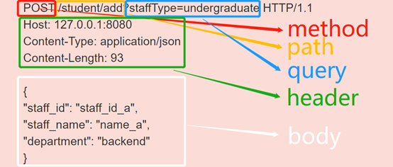

# 第三周



```http
POST  HTTP/1.1
Host: www.demo.com
Cache-Control: no-cache
Postman-Token: 679d816d-8757-14fd-57f2-fbc2518dddd9
Content-Type: multipart/form-data; boundary=----WebKitFormBoundary7MA4YWxkTrZu0gW

------WebKitFormBoundary7MA4YWxkTrZu0gW
Content-Disposition: form-data; name="key"

value
------WebKitFormBoundary7MA4YWxkTrZu0gW
Content-Disposition: form-data; name="testKey"

testValue
------WebKitFormBoundary7MA4YWxkTrZu0gW
Content-Disposition: form-data; name="imgFile"; filename="no-file"
Content-Type: application/octet-stream

<data in here>
------WebKitFormBoundary7MA4YWxkTrZu0gW--
```

首先请求头中的Content-Type 是multipart/form-data; 并且会随机生成一个boundary, 用于区分请求body中的各个数据; 每个数据以 --boundary 开始, 紧接着换行,下面是内容描述信息, 接着换2行, 接着是数据; 然后以 --boundary-- 结尾, 最后换行;