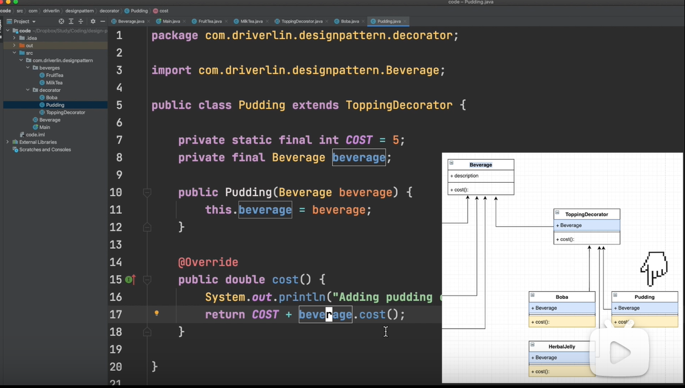
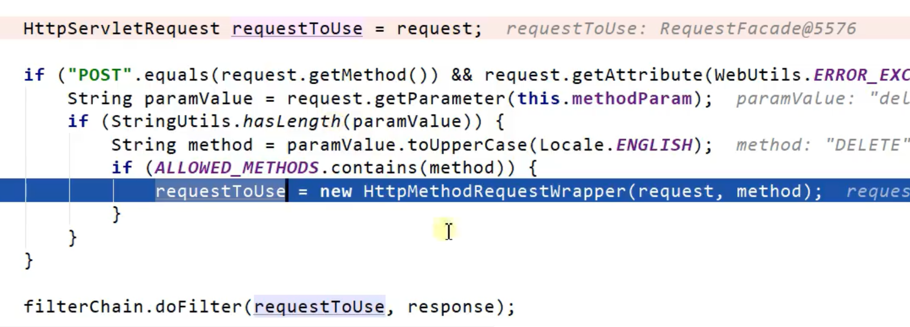
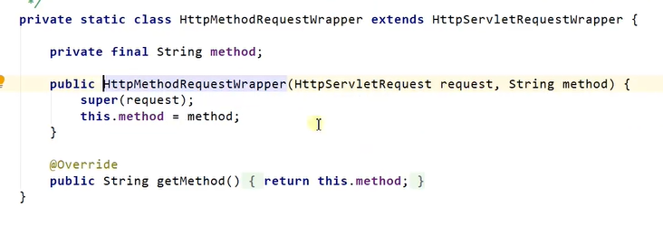
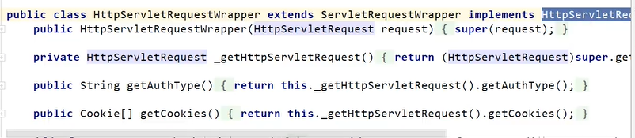
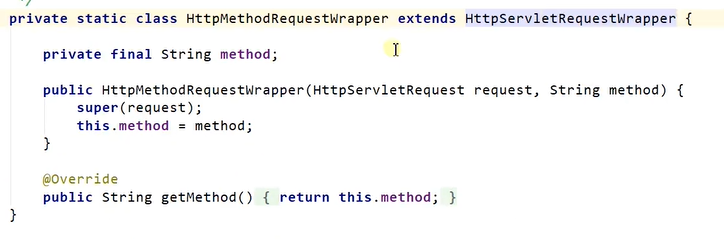
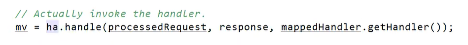

# 设计模式

## 装饰者模式

https://www.bilibili.com/video/BV1Vp4y187dK?from=search&seid=9216454965535468213&spm_id_from=333.337.0.0

下面这个就是装饰器

## 模板方法模式

## 适配器模式

https://www.jianshu.com/p/9d0575311214

同时适配后使用ha.handle运行各种方法
